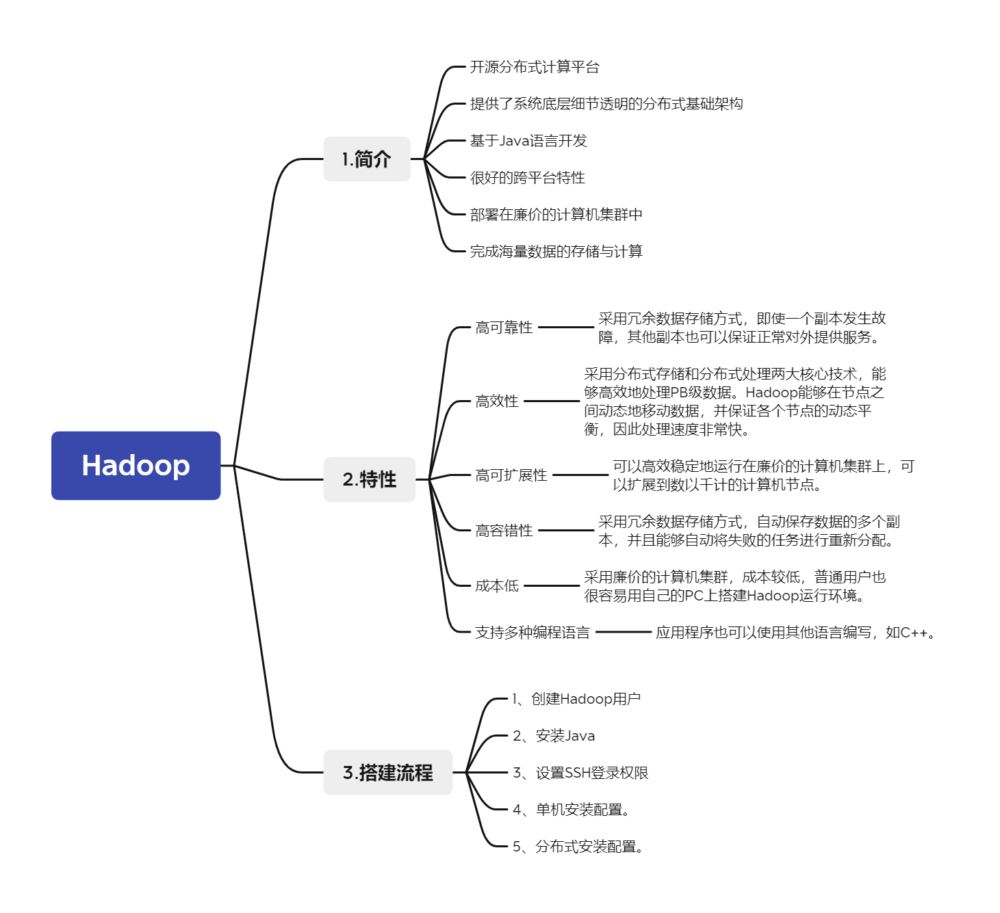

# 一、Hadoop

## 1. Hadoop简介
知识点：Hadoop简介
问题：什么是Hadoop？
分析与解答：
	**Hadoop是Apache软件基金会旗下的一个开源分布式计算平台，为用户提供了系统底层细节透明的分布式基础架构。** Hadoop是基于**Java**语言开发的，具有很好的**跨平台特性**，并且可以**部署在廉价的计算机集群**中。  
	Hadoop的核心是**分布式文件系统HDFS**（Hadoop Distributed File System）和 **MapReduce**。HDFS是对谷歌文件系统(Google File System，GFS）的开源实现，是面向普通硬件环境的分布式文件系统，具有较高的读写速度、很好的容错性和可伸缩性，支持大规模数据的分布式存储，其冗余数据存储的方式，很好地保证了数据的安全性。MapReduce是针对谷歌MapReduce的开源实现，允许用户在不了解分布式系统底层细节的情况下开发并行应用程序，采用MapReduce来整合分布式文件系统上的数据，可保证分析和处理数据的高效性。借助于Hadoop，程序员可以轻松地编写分布式并行程序，可将其运行于廉价计算机集群上，完成海量数据的存储与计算。  
	Hadoop被公认为行业大数据标准开源软件，在分布式环境下提供了海量数据的处理能力。几乎所有主流厂商都围绕Hadoop提供开发工具、开源软件、商业化工具和技术服务，如谷歌、雅虎、微软、思科和淘宝等都支持Hadoop。

## 2. Hadoop特性
知识点：Hadoop特性
问题：Hadoop分别有哪些特点?
分析与解答：
	Hadoop是一个能够对大量数据进行分布式处理的软件框架，并且是以一种可靠、高效、可伸缩的方式进行数据处理，它具有以下几个方面的特性：

- **高可靠性：** 采用冗余数据存储方式，即使一个副本发生故障，其他副本也可以保证正常对外提供服务。Hadoop按位存储和处理数据的能力，值得人们信赖。
- **高效性：** 作为并行分布式计算平台，Hadoop采用分布式存储和分布式处理两大核心技术，能够高效地处理PB级数据。Hadoop能够在节点之间动态地移动数据，并保证各个节点的动态平衡，因此处理速度非常快。
- **高可扩展性：** Hadoop的设计目标是可以高效稳定地运行在廉价的计算机集群上，可以扩展到数以千计的计算机节点。
- **高容错性：** 采用冗余数据存储方式，自动保存数据的多个副本，并且能够自动将失败的任务进行重新分配。
- **成本低：** Hadoop采用廉价的计算机集群，成本较低，普通用户也很容易用自己的PC上搭建Hadoop运行环境。与一体机、商用数据仓库以及QlikView、Yonghong Z-Suite等数据集市相比，Hadoop是开源的，项目的软件成本因此会大大降低。
- **运行在Linux平台上：** Hadoop是基于Java语言开发的，可以较好地运行在Linux平台上。
- **支持多种编程语言：** Hadoop上的应用程序也可以使用其他语言编写，如C++。

## 3.Hadoop搭建流程
知识点：Hadoop搭建流程
问题：简单介绍一下搭建Hadoop集群的流程（简要描述安装配置一个 hadoop 集群的步骤）
分析与回答：

1.  创建Hadoop用户
2.  安装Java
3.  设置SSH登录权限。
4.  单机安装配置。
5.  分布式安装配置。
