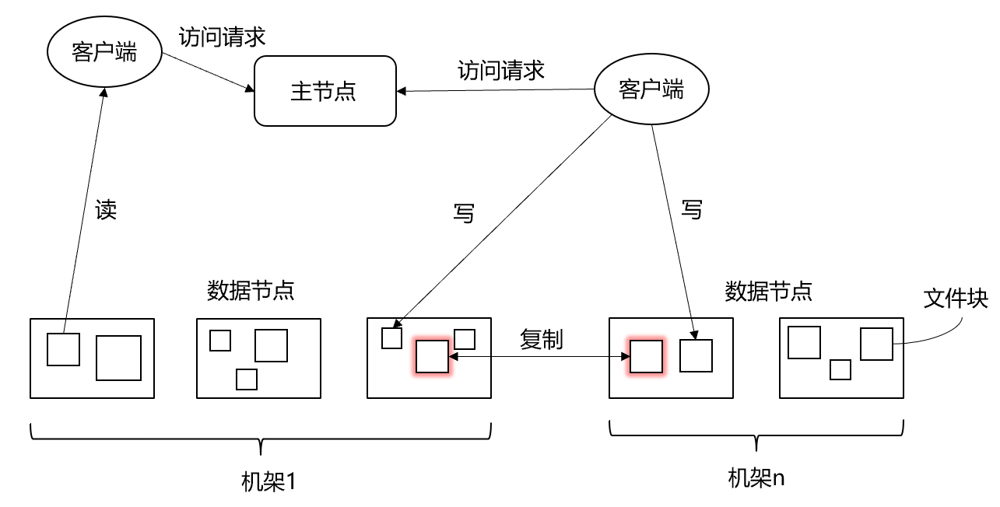
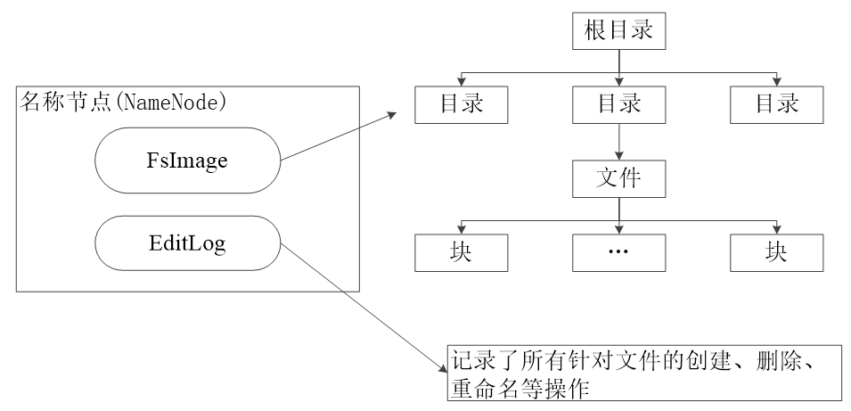
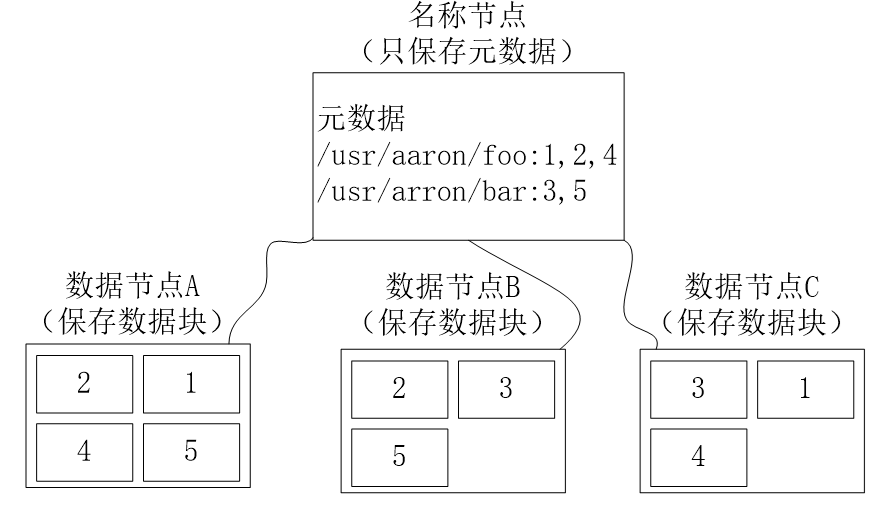
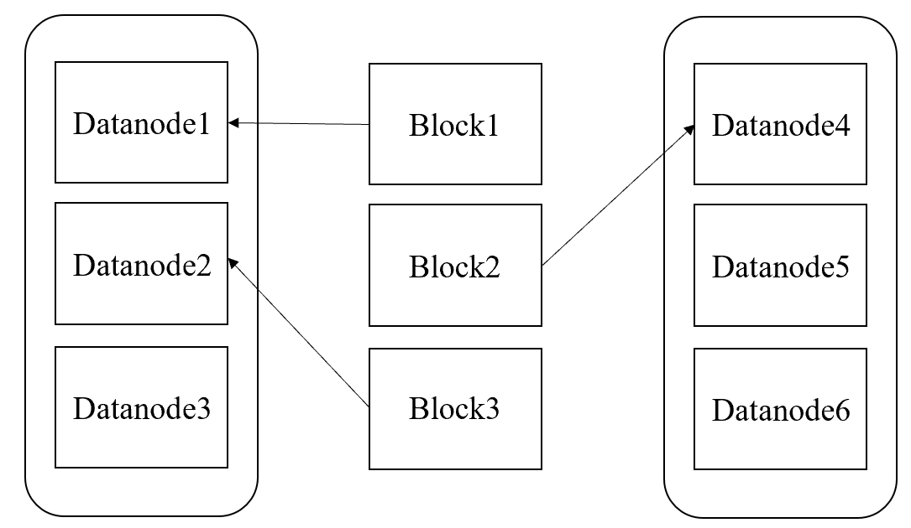
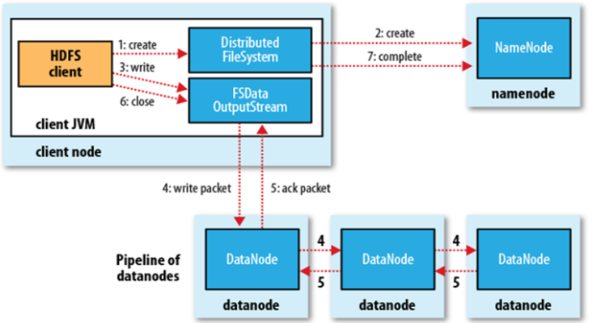
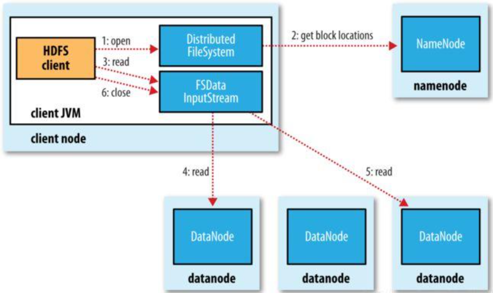

# 二、HDFS

## 1.HDFS组成结构

​	HDFS采用了**主从（Master/Slave）结构模型**，一个HDFS集群包括一个**名称节点（NameNode）**和若干个**数据节点（DataNode**）。

- **名称节点**作为中心服务器，负责管理文件系统的命名空间及客户端对文件的访问。
- **数据节点**负责处理文件系统客户端的读/写请求，在名称节点的统一调度下进行数据块的创建、删除和复制等操作。
- 每个数据节点会周期性地向名称节点发送“心跳"信息，报告自己的状态，没有按时发送心跳信息的数据节点会被标记为“宕机”，不会再给它分配任何I/O请求。

**1.1 说下HDFS的作用，HDFS优缺点，以及使用场景。**
作用：一个用于存储文件的分布式文件系统，通过目录树来定位文件。
优点：

1）**高容错性**

- 数据自动保存多个副本，通过增加副本的机制，提高容错性。

- 某个副本丢失以后，可以实现自动恢复。

2）**适合处理大数据**

- 数据规模：能够处理数据规模达到GB、TB、甚至PB级别的数据
- 文件规模：能够处理百万规模以上的文件数量。

3）**可构建在廉价的机器上，通过副本机制，提高可靠性**

缺点：

1）**不适合低延时数据访问**，比如毫秒级的数据存储，是做不到的。

2）无法高效的对**大量小文件**进行存储

3）不适合**并发写入**、不适合**文件的随机修改**

使用场景：适合做大数据方面的存储工作，不适合做网盘应用

## 2.HDFS的存储机制

​	在系统内部，一个文件会被切分成若干个数据块，这些数据块被分布存储到若干个数据节点上。当客户端需要访问一个文件时，首先把文件名发送给名称节点，名称节点根据文件名找到对应的数据块（一个文件可能包括多个数据块），再根据每个数据块信息找到实际存储在各个数据块的数据节点的位置，并把数据节点位置发送给客户端，最后客户端直接访问这些数据节点获取数据。在整个访问过程中，名称节点并不参与数据的传输。

- 冗余存储存储，HDFS采用了**多副本方式**对数据进行冗余存储，通常**一个数据块的多个副本会被分布到不同的数据节点上**。

  

- 副本的存放策略
  
  
  
  1. 如果是在集群内发起写操作请求，则把第1个副本放置在发起写操作请求的数据节点上，实现就近写入数据。如果是来自集群外部的写操作，则从集群内部挑选一台磁盘空间较为充足、CPU不太忙的数据节点，作为第1个副本的存放地。
  2. 第2个副本会被放置在与第1个副本不同的机架的数据节点上。
  3. 第3个副本会被放置在与第1个副本相同的机架的其他节点上。
  4. 如果还有更多的副本，则继续从集群中随机选择数据节点进行存放。

**2.1 HDFS的常见数据格式，列式存储格式和行存储格式异同点，列式存储优点有哪些?**

在**数据写入**上的对比：
1）行存储的写入是一次完成。如果这种写入建立在操作系统的文件系统上，可以保证写入过程的成功或者失败，数据的完整性因此可以确定。

2）列存储由于需要把一行记录拆分成单列保存，写入次数明显比行存储多（意味着磁头调度次数多，而磁头调度是需要时间的，一般在1ms~10ms)，再加上磁头需要在盘片上移动和定位花费的时间，实际时间消耗会更大。所以，行存储在写入上占有很大的优势。

3）还有数据修改,这实际也是一次写入过程。不同的是，数据修改是对磁盘上的记录做删除标记。行存储是在指定位置写入一次，列存储是将磁盘定位到多个列上分别写入，这个过程仍是行存储的列数倍。所以，数据修改也是以行存储占优。

在**数据读取**上的对比：
1）数据读取时，行存储通常将一行数据完全读出，如果只需要其中几列数据的情况，就会存在冗余列，出于缩短处理时间的考量，消除冗余列的过程通常是在内存中进行的。

2）列存储每次读取的数据是集合的一段或者全部，不存在冗余性问题。

3） 两种存储的数据分布。由于列存储的每一列数据类型是同质的，不存在二义性问题。比如说某列数据类型为整型(int)，那么它的数据集合一定是整型数据。这种情况使数据解析变得十分容易。
相比之下，行存储则要复杂得多，因为在一行记录中保存了多种类型的数据，数据解析需要在多种数据类型之间频繁转换，这个操作很消耗CPU，增加了解析的时间。所以，列存储的解析过程更有利于分析大数据。

4）从数据的压缩以及更性能的读取来对比

**优缺点**

1）行存储的写入是一次性完成，消耗的时间比列存储少，并且能够保证数据的完整性，缺点是数据读取过程中会产生冗余数据，如果只有少量数据，此影响可以忽略；数量大可能会影响到数据的处理效率。

2）列存储在写入效率、保证数据完整性上都不如行存储，它的优势是在读取过程，不会产生冗余数据，这对数据完整性要求不高的大数据处理领域，比如互联网，犹为重要。

　**传统行式数据库**的特性如下：

①数据是按行存储的。

②没有索引的查询使用大量I/O。比如一般的数据库表都会建立索引，通过索引加快查询效率。

③建立索引和物化视图需要花费大量的时间和资源。

④面对查询需求，数据库必须被大量膨胀才能满足需求。

**列式数据库**的特性如下：

①数据按列存储，即每一列单独存放。

②数据即索引。

③只访问查询涉及的列，可以大量降低系统I/O。

④每一列由一个线程来处理，即查询的并发处理性能高。

⑤数据类型一致，数据特征相似，可以高效压缩。比如有增量压缩、前缀压缩算法都是基于列存储的类型定制的，所以可以大幅度提高压缩比，有利于存储和网络输出数据带宽的消耗。

## 3.HDFS的数据读写过程

读数据的过程：

1.  客户端通过 `FileSystem.open()` 打开文件，相应地，在HDFS文件系统中，`DistributedFileSystem`具体实现了`FileSystem`。因此，调用`open()`方法后，`DistributedFileSystem`会创建输入流`FSDataInputStream`，对于HDFS而言，具体的输入流就是`DFSInputStream`。
2.  在`DFSInputStream`的构造函数中，输入流通过`ClientProtocal.getBlockLocations()` 远程调用名称节点，获得文件开始部分的数据块保存位置。对于该数据块，名称节点返回保存该数据块的所有数据节点的地址，同时，根据距离客户端的远近对数据节点进行排序；然后，`DistributedFileSystem`会利用`DFSInputStream`来实例化`FSDataInputStream`，返回给客户端，同时返回了数据块的数据节点地址。
3.  获得输入流`FSDataInputStream`后，客户端调用`read()`函数读取数据。输入流根据前面的排序结果，选择距离客户端最近的数据节点建立连接并读取数据。
4.  数据从该数据节点读到客户端；当该数据块读取完毕时，`FSDataInputStream`关闭与该数据节点的连接。
5.  输入流通过`getBlockLocations()`方法查找下一个数据块（如果客户端缓存中已经包含了该数据块的位置信息，就不需要调用该方法）。
6.  找到该数据块的最佳数据节点，读取数据。
7.  当客户端读取完毕数据的时候，调用`FSDataInputStream`的`close()`函数，关闭输入流。需要注意的是，在读取数据的过程中，如果客户端与数据节点通信时出现错误，就会尝试连接包含此数据块的下一个数据节点。

写数据的过程：

1.  客户端通过 `FileSystem.create()` 创建文件。相应地，在HDFS文件系统中， `DistributedFile System`具体实现了`FileSystem`。因此，调用`create()`方法后，`DistributedFileSystem`会创建输出流对象`FSDataOutputStream`，对于`HDFS`而言，具体的输出流就是`DFSOutputStream`。
2.  然后，`DistributedFileSystem`通过RPC远程调用名称节点，在文件系统的命名空间中创建一个新的文件。名称节点会执行一些检查，比如文件是否已经存在，客户端是否有权限创建文件等。检查通过之后，名称节点会构造一个新文件，并添加文件信息。远程方法调用结束后，`DistributedFileSystem`会利用`DFSOutputStream`来实例化`FSDataOutputStream`，返回给客户端，客户端使用这个输出流写入数据。
3.  获得输出流`FSDataOutputStream`以后，客户端调用输出流的`write()`方法向HDFS对应的文件写入数据。
4.  客户端向输出流`FSDataOutputStream`中写入的数据，会首先被分成一个个的分包，这些分包被放入`DFSOutputStream`对象的内部队列。输出流`FSDataOutputStream`会向名称节点申请保存文件和副本数据块的若干个数据节点，这些数据节点形成一个数据流管道。队列中的分包最后被打包成数据包，发往数据流管道中的第一个数据节点，第一个数据节点将数据包发送给第二个数据节点，第二个数据节点将数据包发送给第三个数据节点，这样，数据包会流经管道上的各个数据节点（即**流水线复制策略**）。
5.  因为各个数据节点位于不同机器上，数据需要通过网络发送，因此，为了保证所有数据节点的数据都是准确的，接收到数据的数据节点要向发送者发送“确认包”（ACK Packet）。确认包沿着数据流管道逆流而上，从数据流管道依次经过各个数据节点并最终发往客户端，当客户端收到应答时，它将对应的分包从内部队列移除。不断执行第3~5步，直到数据全部写完。
6.  客户端调用`close()`方法关闭输出流，此时开始，客户端不会再向输出流中写入数据，所以，当`DFSOutputStream`对象内部队列中的分包都收到应答以后，就可以使用`ClientProtocol.complete()`方法通知名称节点关闭文件，完成一次正常的写文件过程。

**3.1 HDFS的数据一致性靠什么保证?**

1）文件的完整

① 在文件刚刚开始建立的时候，文件中的每个数据块都会产生一个校验和(checksum)，这个校验和会保存在.meta文件内部。

② 客户端获取数据的时候会和这个校验和进行对比，检查是否相同，从而发现数据块是否损坏。

③ 如果说正在读取的数据块损坏，则可以读取其他副本。接着NameNode会标记该block块已经损坏，然后复制该block达到预期设置的文件备份数。

④ DataNode在其文件创建后三周验证其校验和(checksum)

*补*充：
  *校验和–checksum是对一组数据（通常是一个文件）进行算法-加密哈希函数运算得到的结果。通过比较你手头文件和原始文件的校验和，能够确保你对原始文件的拷贝是真的并且不存在错误。*

2）DataNode挂掉

① 副本冗余策略

​	可以指定数据文件的副本数量，默认是3；保证所有的数据块都有副本，不至于在一个datanode宕机后，数据出现丢失现象。

② 机架感知策略

​	集群的机器一般处于不同机架上，机架间带宽要比机架内带宽要小；HDFS具有“机架感知”能力，它能自动实现在本机架上存放一个副本，然后在其它机架再存放另一副本，这样可以防止机架失效时数据丢失，也可以提高带宽利用率。

③ 心跳策略

​	NameNode周期性从DataNode接收心跳信号和块报告，Namenode根据块报告验证元数据；NameNode对没有按时发送心跳的DataNode会被标记为宕机，不会再给它任何I/O请求；DataNode失效造成副本数量下降，并且低于预先设置的阈值；NameNode会检测出这些数据块，并在合适的时机迕行重新复制；引发重新复制的原因还包括数据副本本身损坏、磁盘错误，复制因子被增大等。

3）NameNode挂掉挂掉

① 主备切换
	集群一般会有俩个NameNode，一个处于active状态，一个处于睡眠状态，当第一个Name Node挂掉，集群中睡眠状态的NameNode就会启动。
② 镜像文件和操作日志磁盘存储
	当集群启动的时候，在NameNode启动的时候，如果是集群格式化后，或者说是第一次启动，会创建一个空的(fsimage)镜像空间和(edits)日志文件；否则的话会产生一个新的fsimage和edits，并加载上一次的fsimage和edits到这次的fsimage中。
③ 镜像文件和操作日志可以存储多分，多磁盘存储

**3.2 HDFS写数据过程，写的过程中有哪些故障，分别会怎么处理?**

【NN异常】
由于NN有HA机制，当Active NN出现异常后，standby的NN会自动提升为新的Active接管提供服务，因此只要不是两个NN同时出现异常，就都可以正常读写。
【DN异常】
首先，客户端分两种情况感知DN的异常。这个异常包括DN进程异常，DN所在节点网络异常，或者DN节点存储数据的磁盘异常。
一种是直接与客户端连接的DN异常，客户端通过socket的读写失败，从而感知到该DN的异常。
另一种是非直接与客户端连接的DN异常，与客户端直接连接的DN在给客户端的ack包中会携带异常DN的序号，客户端在处理ack包的时候就能感知哪个DN异常了。
*尽管感知DN异常的方式不一样，但异常的处理逻辑都是一样的。*

异常处理的流程为：

- 首先客户端会关闭当前与DN的连接。

- 接着将待确认的数据重新放回到待发送列表中。

- 接着从DN列表中移除异常DN。

- 然后进行替换DN的处理

  具体包括先判断是否满足替换DN的条件，如果满足条件，则向NN请求增加一个DN，NN分配一个合适的DN并返回给客户端，客户端将新的DN放到DN列表末尾，并以当前DN列表中的第一个DN为源，向其他DN进行block数据的同步，也就是保证传输之前的数据一致性。

- 最后向DN列表中的首个DN发起连接重新进行数据传输的动作。

参考：

[1] [妙趣横生大数据](https://datawhalechina.github.io/juicy-bigdata/#/)

[2] [牛客网](https://www.nowcoder.com/discuss/353503492612403200)