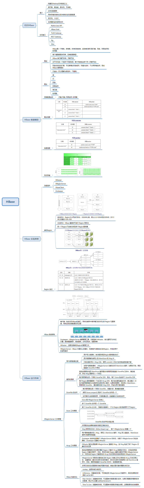
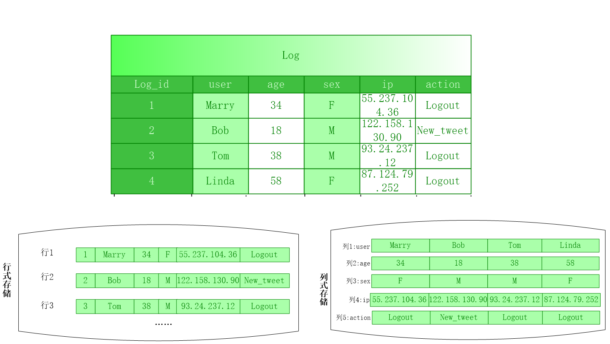
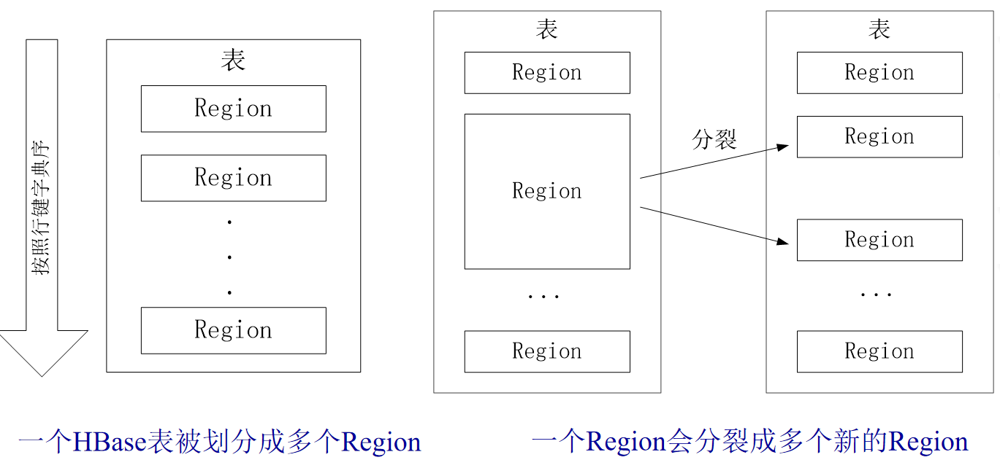
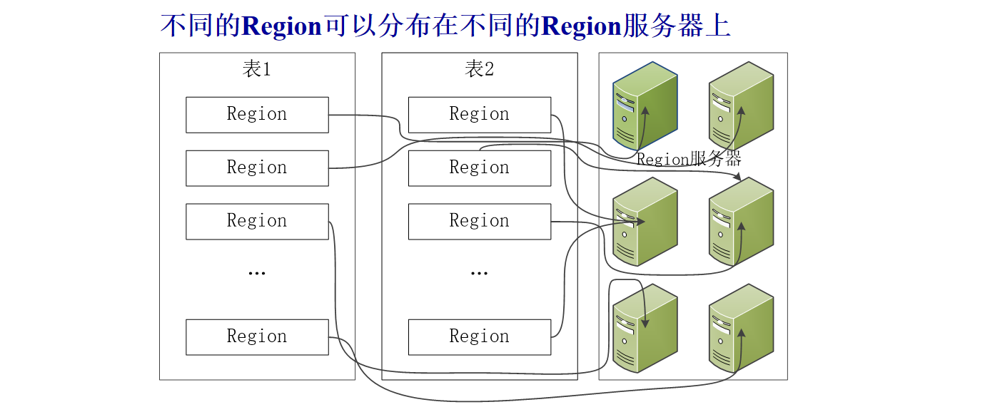
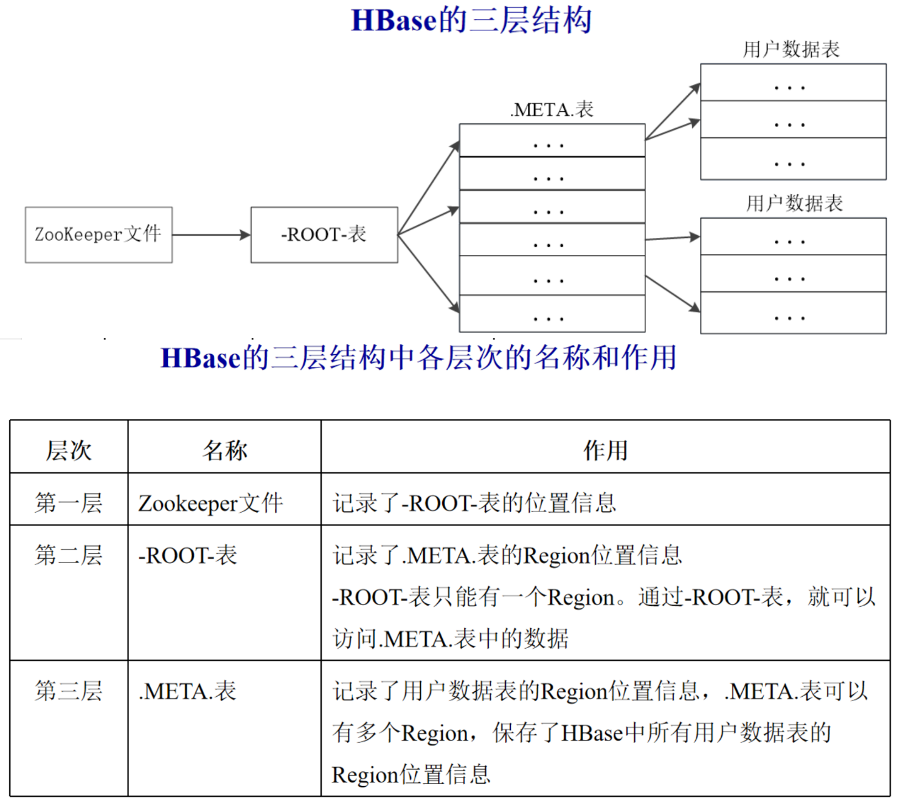
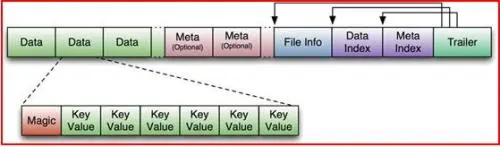

## 1.3 HBase

### 1.3.1 HBase 知识点思维导图



### 1.3.2 HBase 知识点

&emsp;&emsp;HBase是构建在Hadoop文件系统之上的一个**高可靠、高性能、面向列、可伸缩**的**分布式数据库**，主要用来存储**非结构化**和**半结构化**的松散数据。它是谷歌 BigTable 的开源实现，可以通过水平扩展的方式，利用廉价计算机集群处理由超过 **10亿行数据和数百万列元素** 组成的数据表。  

#### **HBase 数据模型的相关概念**

- **表**：HBase 采用表来组织数据，表由行和列组成，列划分为若干个列族。
- **行**：每个 HBase 表都由若干行组成，每个行由行键（row key）来标识。
- **列族**：一个 HBase 表被分组成许多“列族”（Column Family）的集合，它是基本的访问控制单元。表中的每个列都归属于某个列族，数据可以被存放到列族的某个列下面（列族需要先创建好）。在创建完列族以后，就可以使用同一个列族当中的列。列名都以列族作为前缀。例如，`info:name`和`info:age`这两个列都属于`info`这个列族。
- **列限定符**：列族里的数据通过列限定符（或列）来定位。
- **单元格**：在 HBase 表中，通过行、列族和列限定符确定一个“单元格” ( cell )，单元格中存储的数据没有数据类型，总被视为字节数组`byte[]`。
- **时间戳**：每个单元格都保存着同一份数据的多个版本，这些版本采用时间戳进行索引。

&emsp;&emsp;下面用一个示例为阐释HBase的数据模型，下图为一张用来存储学生信息的HBase表：


&emsp;&emsp;学号作为行键来唯一标识每个学生，表中设计了列族`Info`来保存学生相关信息，列族`Info`中包含3个列——`name`、`major`和`email`，分别用来保存学生的姓名、专业和电子邮件信息。  
&emsp;&emsp;学号为`201505003`的学生存在两个版本的电子邮件地址，时间戳分别为`ts1=1174184619081`和`ts2=1174184620720`，时间戳较大的版本的数据是最新的数据。

#### **列式存储与行式存储方式**

&emsp;&emsp;列式存储与行式存储是数据存储的两种方式，两种存储方式各有优缺点，采用哪种方式进行数据存储，取决于具体的应用场景，下面我们通过一个简单的示例来看一下这两种数据存储方式的差异。



1. **传统行式数据库**  
- 数据是按行存储的
- 没有索引的查询使用大量I/O。在从磁盘中读取数据时，需要从磁盘中顺序扫描每个元组的完整内容，然后从每个元组中筛选出查询所需要的属性
- 建立索引和物理视图需要花费大量时间和资源
- 面对查询的需求，数据库必须被大量膨胀才能满足性能要求

2. **列式数据库**  
- 数据按列存储，每一列单独存放
- 数据即是索引
- 只访问查询涉及的列，大量降低系统IO
- 每一列由一个线索来处理，查询采用并发处理方式
- 数据类型一致，数据特征相似，采用高效压缩方式
- 缺陷：执行链接操作时，需要昂贵的元组重构代价

#### **Region 知多少？**

&emsp;&emsp;在一个 HBase 中，存储了很多的表。对于每个 HBase 表而言，表中的行是根据行键的值的字典序进行维护的，表中包含的行的数量可能非常庞大，无法存储在一台机器上，需要分布存储到多台机器上。因此，需要根据行键的值对表中的行进行分区。每个行键值的区间构成一个分区，被称为 Region。Region 包含了位于某个值域区间内的所有数据，是负载均衡和数据分发的基本单位。



**生成Region的过程：**
1. 默认情况下，开始只有一个 Region，随着数据不断的插入，Region 越来越大。当达到一定的阈值时，开始分裂成两个新的 Region；
2. 随着表中行的数量继续增加，就会分裂出越来越多的 Region；
3. Region 拆分操作非常快，因为拆分之后的 Region 读取的仍然是原存储文件，直到“合并”过程把存储文件异步地写到独立的文件之后，才会读取新文件。



其中：
- 每个 Region 默认大小是100MB到200MB（2006年以前的硬件配置），每个 Region 的最佳大小取决于单台服务器的有效处理能力，目前每个 Region 最佳大小建议1GB-2GB（2013年以后的硬件配置)
- 同一个 Region 不会被分拆到多个 Region Server
- 每个 Region Server 负责管理一个 Region 集合，通常在每个 Region Server会存储10-1000个 Region

&emsp;&emsp;一个 HBase 的表可能非常庞大，会被分裂成很多个 Region，这些 Region 可被分发到不同 Region Server 上。那么，**HBase 是如何定位数据的呢？**
&emsp;&emsp;每个 Region 都有一个`RegionID`来标识它的唯一性，这样，一个 Region 标识符就可以表示成`表名＋开始主键+RegionID`。
&emsp;&emsp;为了定位每个 Region 所在的位置，可以构建一张映射表，每行包含两项内容（表示 Region 和 Region Server 之间的对应关系，从而就可以知道某个 Region 被保存在哪个 Region Server中）：**Region 标识符**、**Region Server 标识**。
&emsp;&emsp;这个映射表包含了关于 Region 的元数据（即 Region 和 Region Server 之间的对应关系）。因此，也被称为“元数据表”，又名`.META.` 表。
&emsp;&emsp;当一个 HBase 表中的 Region 数量非常庞大的时候，`.META.` 表的条目就会非常多 ，一个服务器保存不下，也需要分区存储到不同的服务器上，因此，`.META.` 表也会被分裂成多个 Region。
&emsp;&emsp;这时，为了定位这些 Region，就需要再构建一个新的映射表，记录所有元数据的具体位置，这个新的映射表就是“根数据表”，又名 `-ROOT-` 表。该表的特点有：  

- `-ROOT-` 表是不能被分割的，永远只存在一个 Region 用于存放 `-ROOT-` 表。
- 这个用来存放 `-ROOT-` 表的唯一个 Region，它的名字是在程序中被写死的，Master 主服务器永远知道它的位置。

&emsp;&emsp;综上所述，HBase使用类似B+树的三层结构来保存Region位置信息，详见下图：



&emsp;&emsp;三层结构的特点：
- 为了加快访问速度，`.META.` 表的全部 Region 都会被保存在内存中
- 客户端访问数据时采用的是三级寻址
- 为了加速寻址，客户端会缓存位置信息。同时，需要解决缓存失效问题
- 寻址过程客户端只需要询问 Zookeeper 服务器，不需要连接 Master 服务器。因此，主服务器的负载相对就小了很多。

#### **HLog工作原理**

&emsp;&emsp;在分布式环境下，必须考虑到系统出错的情形，比如当Region服务器发生故障时，`MemStore` 缓存中的数据（还没有写入文件）会全部丢失。因此，HBase用 `HLog` 来保证系统发生故障时能够恢复到正确的状态，`HLog` 具有以下特点：  

- HBase系统为每个 Region Server 配置了一个 `HLog` 文件，它是一种预写式日志（ Write Ahead Log ）。
- 用户更新数据必须首先写入日志后，才能写入 `MemStore` 缓存，并且，直到 `MemStore` 缓存内容对应的日志已经写入磁盘后，该缓存内容才能被刷写到磁盘。
- Zookeeper会实时监测每个 Region Server 的状态，当某个 Region Server 发生故障时，Zookeeper 会通知 Master。
- Master首先会处理该故障 Region Server 上面遗留的 `HLog` 文件，这个遗留的 `HLog` 文件中包含了来自多个 Region 对象的日志记录。
- 系统会根据每条日志记录所属的 Region 对象对 `HLog` 数据进行拆分，分别放到相应 Region 对象的目录下，然后，再将失效的 Region 重新分配到可用的 Region Server  中，并把与该 Region 对象相关的 `HLog` 日志记录也发送给相应的 Region Server 。
-  Region Server 领取到分配给自己的 Region 对象以及与之相关的 `HLog` 日志记录以后，会重新做一遍日志记录中的各种操作，把日志记录中的数据写入到 `MemStore` 缓存中，然后，刷新到磁盘的`StoreFile` 文件中，完成数据恢复。
- 共用日志的优点是提高对表的写操作性能；其缺点是恢复时需要分拆日志。

#### **HBase性能优化**

- **行键（Row Key）**： 行键是按照字典序存储。因此，设计行键时，要充分利用这个排序特点，将经常一起读取的数据存储到一块，将最近可能会被访问的数据放在一块。例如：如果最近写入HBase表中的数据是最可能被访问的，可以考虑将时间戳作为行键的一部分 。
- **InMemory**：创建表的时候，可将表放到Region服务器的缓存中，保证在读取的时候被 `cache` 命中。
- **Max Version**：创建表的时候，可设置表中数据的最大版本，如果只需要保存最新版本的数据，那么可以设置 `setMaxVersions(1)`。
- **Time To Live**：创建表的时候，可设置表中数据的存储生命期，过期数据将自动被删除。

### 1.3.3 HBase 面试题

#### 1.3.3.1 问题1：介绍一下 HBase 表设计注意事项？

HBase 建表语句可以非常简单，类似这样： `create 't1', 'f1'`，那么这种方式创建的表，可以在生产环境使用吗？

通过前面的学习我们知道，默认情况下，HBase Region 拆分是被动进行的，也就的大的不能再大了才进行拆分，如果建表时没有进行 Region 预分区，那么就只有一个 Region，而一个 Region 对应一台服务器，也就是说在这种情况下，用户数据的存储和处理都会在某一台服务器上进行，集群并没有好好利用起来。怎么办呢？建表时进行预分区就好了，HBase Region 预分区与 HBase 表 rowkey 设计紧密相关，仅仅设置了预分区还不够，通过合理的 rowkey 设计，让数据均匀的分布在你预先创建好的各个 Region 分区里，才能高效的利用集群资源。

#### 1.3.3.2 问题2：介绍一下 HBase rowkey 设计思路？

通过上一题我们知道，为了高效的利用集群资源，要对 rowkey 进行合理的设计，那么，如何设计出合理的 rowkey 呢？

首先 rowkey 的设计要以数据特征为出发点，通过各种手段了解、掌握数据的特征，包括业务主键的设置，是一列还是多列？业务主键的取值范围？

比如说某张表的业务主键是 pid， pid 是一个八位的递增数字，如果直接将 pid 作为 rowkey，当天产生的业务数据大概率落入同一个 Region 分区（因为递增数据的前几位是相同的），很容易出现数据热点问题，这种情况 Region 预分区并未起到应有的作用。

将 pid 反转作为 rowkey 的前缀是很好的一个思路，因为八位递增数字的末尾数字 `0~9` 是均匀分布的，反转之后，可以均匀的落入不通的 Region 预分区，实际工作中，经常以 `10~90` 作为预分区的依据，建表语句示例如下：
```shell
create  'ods:ods_test_pid', 'info',{SPLITS => ['10|','20|','30|','40|','50|','60|','70|','80|','90|']}
```
除了这个思路，时间戳也经常作为 rowkey 的一部分，主要有以下几点原因：
1. 时间排序
因为 HBase 的 rowkey 是排序的,所以包含时间戳可以保证记录按时间顺序排序。这对于时间序列数据很重要,可以方便地查询某个时间范围内的记录。
2. 唯一性
通常我们会将时间戳组合成 rowkey 的一部分，以保证 rowkey 的唯一性。如果只使用简单的自增 id，在高并发场景下可能会产生 id 重复的问题。加入时间戳可以有效解决这个问题。
3. 定期轮转
如果 rowkey 中包含日期或小时，那么表的数据会按日期或小时自动分割成不同的区域。这可以方便定期对旧数据进行归档或删除。
4. 范围扫描
包含时间戳的 rowkey 可以方便地通过 rowkey 范围扫描 certain 时间范围内的全部数据。这对一些时间序列数据分析场景很有用。
5. 写入高效
HBase 的写入是根据 Rowkey 的字典序插入的。包含时间戳的 rowkey 可以保证新写入的数据都插入在表的末尾，这样可以使写入更高效，减少重新排列既有数据的次数。

#### 1.3.3.3 问题3：HBase rowkey 设计原则？

1. rowkey 越短越好。rowkey 会在 HBase 的每个存储文件(HFile)中重复存储,所以 rowkey 越短，存储开销越小，查询效率越高。
2. 要避免 rowkey 的前缀相同。如果 rowkey 的前缀相同，会导致数据倾斜，影响表的负载均衡。
3. rowkey 应由多个属性的组合构成。每个属性单独作为 rowkey 不够，必须构造一个合理的 rowkey，才可以查询和归档数据。
4. rowkey 中时间属性放前面。这样可以利用 HBase 的本地存储特性，查询特定时间范围数据的时候效率更高。
5. rowkey 要与二级索引一起考虑。如果 rowkey 符合一定规律，那么可以基于 rowkey 构建二级索引，加速查询。
6. 要考虑 region 分裂。region 的切分也是基于 rowkey 的，有序的 rowkey 可以实现更均匀的 region 分布。
7. rowkey 要有一定的业务针对性。rowkey 的设计也要考虑业务场景，不能完全学术化。

总之,一个好的 rowkey 设计应该：
- 长度适中，不要太长；
- 前缀不同，不会导致数据倾斜；
- 包含业务相关的多个属性；
- 时间字段在前面；
- 符合二级索引需求；
- 有序，支持均衡的 region 分布；
- 有一定的业务针对性。

rowkey 的设计是 HBase 表设计的关键,要综合考虑 HBase 的架构特性和业务需求,才能设计出高性能的表。

#### 1.3.3.4 问题4：HBase 默认以 rowkey 的哪几位进行分区？为什么？

HBase 默认以 rowkey 的前两位进行分区，主要有以下几个原因:
1. 提高查询效率。HBase 的数据存储在 Region 中，Region 的划分是依据 rowkey 进行的。如果 rowkey 前面几位相同的记录存储在同一个 Region 中，那么查询这些记录只需要访问一个 Region，这样可以减少 Region 扫描的次数，提高查询效率。
2. 实现排序。HBase 中记录的物理存储顺序是按照 rowkey 排序的。如果 rowkey 前面几位相同，那么这些记录会被存储在一块，自然也就实现了按这几位的排序。
3. 实现分片负载均衡。新加节点时，HBase 会自动把其他节点的一部分 Region 迁移过来。如果记录按前几位划分到各个 Region，那么各个 Region 的大小就会比较均匀，能实现比较好的分片负载均衡。
4. 方便批量读取。如果按 rowkey 前几位划分 Region，那么读取这几位相同的记录时，只需要访问一个 Region，那么这些记录可以通过 scan 操作批量获取，效率比较高。如果不是按前几位划分，那么不同的记录可能在不同的 Region,需要访问多个 Region，效率会低很多。

但是，如果 rowkey 前几位相同的记录特别多，就会导致“热点”问题，这些 Region 会出现访问负载过大的情况。所以，HBase 中默认采取 rowkey 前两位进行分区，如果需要的话，也可以配置为 3 位或更多位，需要根据实际情况选择最优的划分策略。

总之，HBase 选用 rowkey 前几位进行分区，主要是为了提高效率，实现排序和负载均衡。但也可能引发“热点”问题，所以需选择最优的划分策略。

#### 1.3.3.5 问题5：HBase 如何设置按照 rowkey 的前三位进行分区？

HBase 中 Region 的划分是由 split 参数控制的，默认情况下，Region 会按 rowkey 的前两位进行分割。如果要自定义分割策略，需要配置 split 参数。

要按 rowkey 的前三位进行分区，可以这样配置:
1. 在 `hbase-site.xml` 中添加以下 property:
```xml
<property>
  <name>hbase.prefix.split.enable</name>
  <value>true</value>   
</property>
```
开启 prefix split 特性。
2. 设置 split 的策略为 PREFIX_TREE。在 `hbase-site.xml` 中添加:
```xml
<property>        
  <name>hbase.prefix.split.policy</name>            
  <value>PREFIX_TREE</value>  
</property>  
```
3. 指定前三位作为分割策略。在 `hbase-site.xml` 中添加:
```xml
<property>      
  <name>hbase.prefix.tree.depth</name> 
  <value>3</value>
</property>
```
4. 重启 HBase 集群。
这样,HBase 的 Region 就会按照 rowkey 的前三位进行分割，从而实现按前三位进行分区。
相关的 `hbase-site.xml` 配置如下:
```xml
<property>       
  <name>hbase.prefix.split.enable</name>          
  <value>true</value>           
</property>    

<property>           
  <name>hbase.prefix.split.policy</name>       
  <value>PREFIX_TREE</value>       
</property>

<property>       
  <name>hbase.prefix.tree.depth</name>                  
  <value>3</value>
</property>
```
通过配置 split 相关的参数，我们可以灵活地控制 HBase 的 Region 分割策略，实现按 rowkey 的任意前缀位数进行分区。 

#### 1.3.3.6 问题6：介绍一下 HBase 二级索引原理？

HBase 本身不支持二级索引，但是可以通过自定义的方式实现二级索引功能。HBase 二级索引的基本原理是:
1. 在 HBase 表中添加一个列族,用于存储二级索引数据。这个列族通常命名为 info。
2. 向 info 列族中的列中写入对应行键的数据。这些数据可以是行键本身，也可以是计算出来的类行键值。
3. 创建一个新的 HBase 表，这个表只有一个列族 info，用来存储索引数据。这个表即为二级索引表。
4. 当对基表进行增删改操作时，同时更新索引表，保证索引表中的数据与基表同步。
5. 当需要使用二级索引查询数据时，先扫描索引表查找索引数据，得到行键列表。然后使用行键列表查询基表，返回结果。
6. 可选步骤:为提高查询效率，索引表可以增加一个指向基表中行位置的指针。这样查询可以直接定位到基表对应数据，加速查询。
简单来说，HBase 二级索引通过在基表中构建一个新的列族存储索引数据，然后创建一个单独的索引表保存这些索引数据，实现对数据的索引和快速查找。但需要手动实现与基表的同步，保证索引数据的最新性。
此外，HBase还有其他索引实现方式，比如倒排索引表、基于过滤器的索引等。但二级索引是最常用和简单的实现方式。
二级索引虽然可以快速找到对应数据的行键，但是仍需要扫描整表数据，所以并不适合用于大量随机查找。如果需要处理这种场景，可以考虑在 HBase 之上构建 Solr 等搜索引擎。

#### 1.3.3.7 问题7：介绍一下 HBase 数据压缩的方式？

为了提高 HBase 数据存储的利用率，我们会对 HBase 表中的数据进行压缩。目前 HBase 可以支持的压缩方式有 GZ（GZIP）、Snappy、LZO、LZ4 以及 ZSTD。它们之间的区别如下：

GZ：是一种流行的压缩格式，HBase中的数据在写入磁盘前会先进行GZ压缩，可以有效减少HFile的大小，提高存储效率。GZ压缩支持的压缩比由表的目标块大小决定，压缩效果一般在3倍左右。GZ 一般用于冷数据（访问频率较低）压缩，与 Snappy 和 LZO 相比，GZIP 的压缩率更高，但是更消耗 CPU，解压/压缩速度更慢。

LZO：是一种开源的无损数据压缩算法，压缩速度快，压缩比相比 GZ 略低但解压速度更快。HBase 可选用 LZO 压缩以提高读写性能。

Snappy：是 Google 开发的一种压缩格式,同样支持无损压缩。HBase 支持 Snappy 压缩，可以在不影响读写性能的前提下获得更高的存储效率。

Snappy 和 LZO 一般用于热数据（访问频率很高）压缩。

Snappy 与 LZO 相比，Snappy 整体性能优于 LZO，Snappy 压缩率比 LZO 更低，但是解压/压缩速度更快。

LZ4：是一种较新压缩算法,压缩率与 Snappy 相当，但解压缩速度更快。

ZSTD：是一种全新的压缩算法，被誉为“下一代压缩算法”。它提供高压缩率与高压缩速度,是目前最先进的无损压缩算法之一。2017年双11开始，已在阿里内部开始应用。

各种压缩各有不同的特点，我们需要根据业务需求（压缩率、解压和压缩速率等）选择不同的压缩格式。


#### 1.3.3.8 问题8：数据如何写入 HBase？

首先，当用户更新 HBase 表中的数据时，它将对提交日志进行记录，该记录在 HBase 中称为预写日志（WAL）。
接下来，将数据存储在内存中的 MemStore 中。如果内存中的数据超过最大值，则将其作为 HFile 刷新到磁盘。
数据刷新之后，用户可以丢弃提交日志。

#### 1.3.3.9 问题9：介绍一下 HFile 和 HLog 的区别？

HFile 是 HBase 中 KeyValue 数据的存储格式(这里不要把 KeyValue 想成 Map 的那种形式，理解起来会好一点)，HFile 是 Hadoop 的二进制格式文件，实际上 StoreFile 就是对 HFile 做了轻量级包装，即 StoreFile 底层就是 HFile 。



HFile 由六部分组成：
- Data（数据块）：保存表中的数据（KeyValue的形式），这部分可以被压缩。
- Meta （元数据块）：存储用户自定义KeyValue
- File Info：定长；记录了文件的一些元信息，例如：AVG_KEY_LEN，AVG_VALUE_LEN，LAST_KEY，COMPARATOR，MAX_SEQ_ID_KEY 等
- Data Index（数据块索引）：记录了每个 Data 块的起始索引
- Meta Index（元数据块索引）：记录了每个 Meta 块的起始索引
- Trailer：定长，用于指向其他数据块的起始点。

HLog 文件就是一个普通的 Hadoop Sequence File(也是KeyValue形式，与前面的数据块中的KeyValue类比)，是用来做灾难恢复的。
HLog Sequence File 的 Key 是 HLogKey 对象，HLogKey 中记录了写入数据的归属信息，除了 table 和 region 名字外，同时还包括 sequence number 和 timestamp，timestamp 是“写入时间”，sequence number 的起始值为0，或者是最近一次存入文件系统中 sequence number。
HLog Sequence File 的 Value 是 HBase 的 KeyValue 对象，即对应 HFile 中的 KeyValue。包括：row、column family、qualifier、timestamp、value 以及“Key Type”（比如 PUT 或 DELETE )

### 1.3.4 HBase 小集锦

**HBase与关系型数据库(RDBMS)的主要区别有哪些？**

HBase 与关系型数据库(RDBMS)的主要区别有:
1. 数据模型不同
HBase 是面向列的，而 RDBMS 是面向行的。HBase 中以行键为主，列族，列标识符和单元格来存储数据。RDBMS 中以行为主，每个行有固定的列结构。
2. 架构不同
HBase 基于分布式架构，RDBMS 基于单机架构。HBase 采用主从复制来保证高可用，RDBMS 使用主备切换。
3. 可扩展性不同
HBase 可线性扩展，易处理 PB 级别数据。RDBMS 扩展相对复杂，处理 GB 以上数据时性能明显下降。
4. 数据类型不同
HBase 只支持字节数组，而 RDBMS 支持丰富的数据类型，如数值，字符串，日期等。
5. 事务支持不同
HBase 本身不支持事务，但可以通过外部补充达到事务特征。RDBMS 天然支持丰富的事务功能。
6. MapReduce支持不同
HBase 内置 MapReduce，方便大数据离线分析。RDBMS 需要额外的 MapReduce 框架才支持，如 Hadoop。
7. 设计理念不同
HBase 面向海量数据的高吞吐量和高可扩展，而 RDBMS 面向 OLTP，追求高一致性和丰富功能。
8. 一致性保证不同
HBase 保证最终一致性，RDBMS 保证 ACID 一致性。
9. 定制性不同
HBase 开放的架构，各个组件之间的接口清晰，易于替换和定制。RDBMS 封闭的架构，不便于定制。
10. 成本不同
HBase 作为开源软件，降低了技术和成本门槛。商用 RDBMS 成本较高，特别是高可用和高扩展版本。
总之，HBase 和 RDBMS 有着明显的差异，各有各的应用场景。合理选择并发挥各自优势，才能实现最大效益。

**HBase 与 HDFS 对比**

HDFS 是分布式文件存储系统，而 HBase 是面向列的分布式数据库。HBase 在 HDFS 之上构建，利用 HDFS 进行数据存储，但 HDFS 本身并不具备数据库的功能，如数据索引、解析、计算等。

**同为 KV 数据库，HBase 与 MongoDB 有何区别？**

MongoDB 是文档型数据库，而 HBase 是列式数据库。MongoDB 以 JSON 格式的文档为中心，schema 更加灵活。HBase 面向列，存储格式更加定制化且紧凑。MongoDB 不支持锁机制，不适合强一致性需求，而 HBase 提供的一致性更高。

**HBase 与 Hive 区别？**

Hive 和 HBase 都用于大数据分析，但是 Hive 基于 HDFS 文件存储，并将 SQL 转换为 MapReduce 作业。Hive 更加适合离线分析。而 HBase 作为在线数据库，实时读写性能更高，支持随机实时查询。

**HBase 与 Impala 区别？**

Impala 是大数据分析引擎，也是在 HDFS 上构建，将 SQL 转换为 MapReduce。Impala 的查询效率更高，适用于交互式数据分析，而 HBase 作为在线数据库，数据更新更加实时，并支持按行键的实时写入。

**HBase 中重要的过滤器有哪些？**

行过滤器，列过滤器，页面过滤器，族过滤器，包含停止过滤器。

**WAL 是什么？**

WAL （Write Ahead Log） 类似于 MySQL binlog 日志。该日志记录表数据中的所有更改，而不管更改方式如何。该日志文件本身是标准序列文件。该文件的主要作用是：即使在服务器崩溃后也能向用户提供数据访问。


**参考资源：https://www.jianshu.com/p/56b83585d8ce**