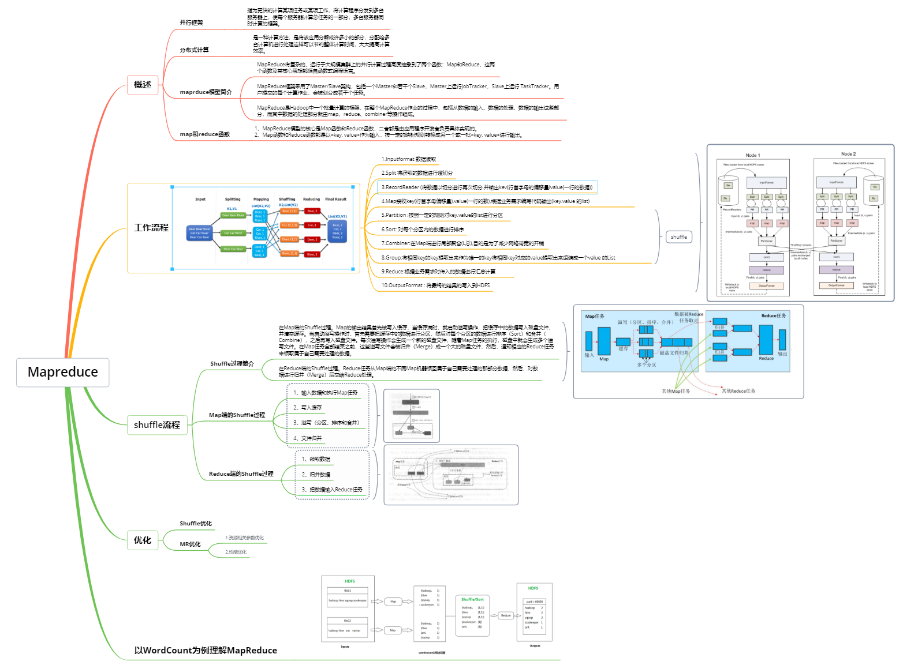
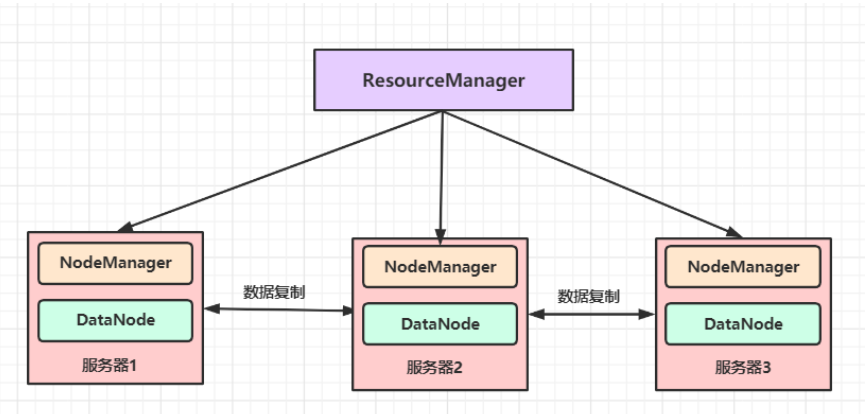
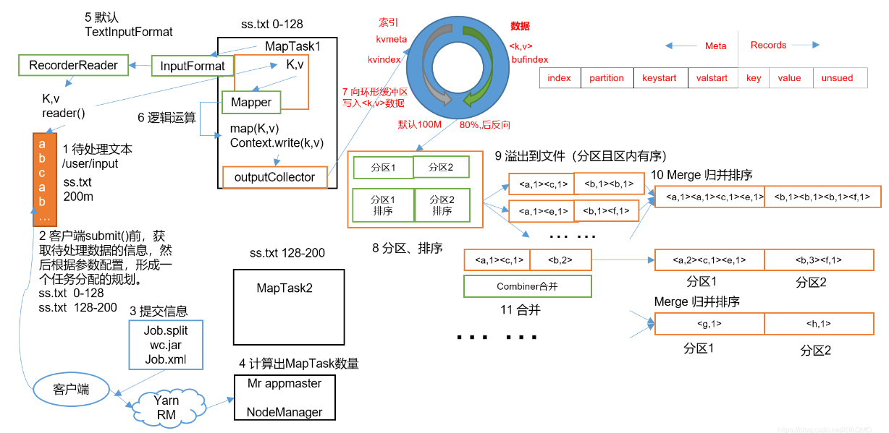
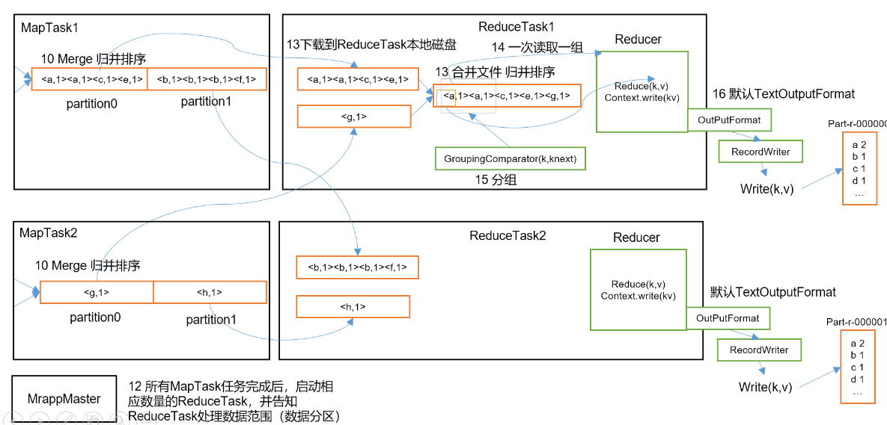
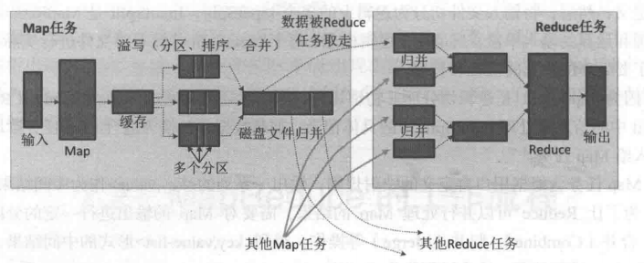
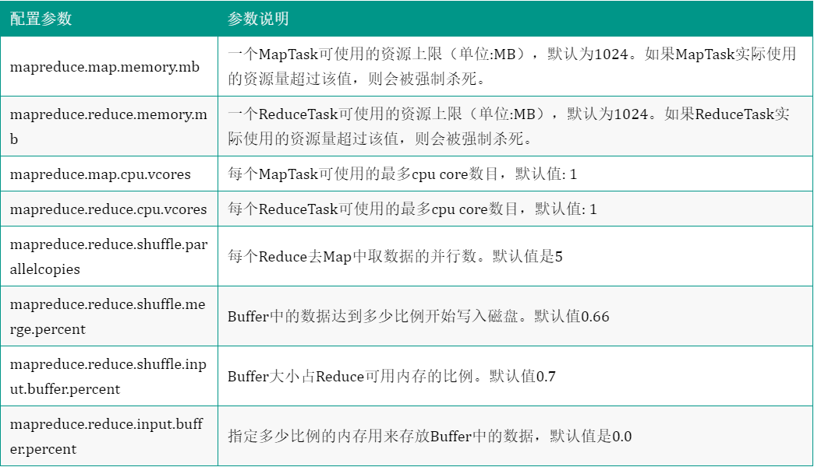
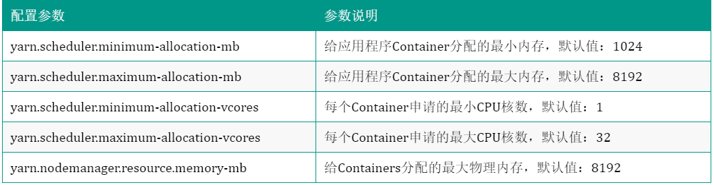
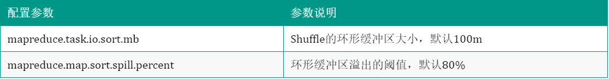
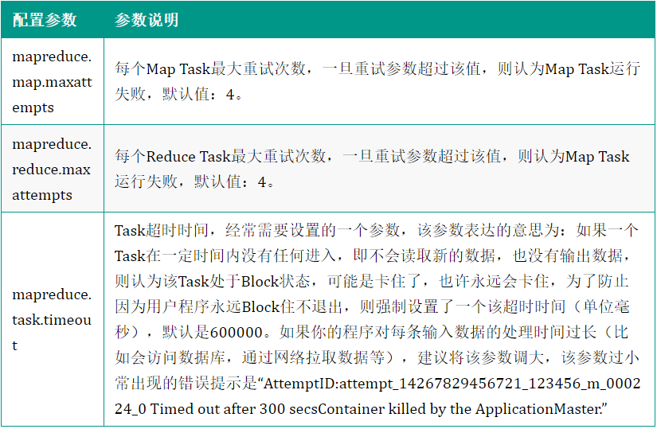

# 1.4 Mapreduce

## Mapreduce 知识点思维导图

**MapReduce知识总览：**

- 概述：介绍MapReduce的概念、发展历程、优势和局限性。
- 基础知识：包括分布式系统、Hadoop、HDFS、YARN等基础知识。
- 编程模型：讲解MapReduce编程模型、Map函数和Reduce函数、Shuffle 原理和减少 Shuffle 的方法等。
- 运行过程：掌握 MapReduce 的工作原理，包括Map阶段、Shuffle阶段和Reduce阶段的具体过程。
- 优化技巧：提高MapReduce程序性能的技巧。
- 应用案例：介绍MapReduce在实际应用中的案例，如单词计数WordCount 或者 TopN 算法、倒排索引、PageRank等。
- 发展趋势：介绍MapReduce的发展趋势，如Spark、Flink等技术的兴起。

## 1.4.1 Mapreduce概述

### 1.4.1.1 分布式并行编程

分布式并行程序可以运行在由大量计算机构成的集群上，从而可以充分利用集群的并行处理能力，同时，通过向集群中增加新的计算节点，就可以很容易实现集群计算能力的扩充。

### 1.4.1.2 MapReduce模型概念

MapReduce是一个分布式运算程序的编程框架，是用户开发基于Hadoop的数据分析应用的核心框架。 MapReduce 提供了海量数据高并行计算的能力。其核心功能是将用户编写的业务逻辑代码和自带默认组件整合成一个完整的分布式运算程序，并发运行在一个Hadoop集群上。MapReduce采用“分而治之”思想，将复杂的、运行于大规模集群上的并行计算过程高度抽象到了两个函数：`Map`和`Reduce`，这两个函数及其核心思想都源自函数式编程语言。 

### 1.4.1.3 MapReduce模型简介&emsp;

 MapReduce 框架由一个主节点（ResourceManager）、多个子节点（NodeManager）和每个执行任务的 MR AppMaster 共同组成 。通常会将 MapReduce 的计算节点和存储节点部署在同一台服务器上，如图所示：

MapReduce是Hadoop中一个批量计算的框架，采用Master/Slave架构，在整个MapReduce作业的过程中，包括**从数据的输入、数据的处理、数据的输出**这些部分，而其中数据的处理部分就由**map、reduce、combiner**等操作组成。在一个MapReduce的作业中必定会涉及到如下一些组件：

- 客户端：提交MapReduce作业
- yarn资源管理器：负责集群上计算资源的协调
- yarn节点管理器：负责启动和监控集群中机器上的计算容器（container）
- MapReduce的`application master`：负责协调运行MapReduce的作业
- HDFS：分布式文件系统，负责与其他实体共享作业文件

## 1.4.2 MapReduce的工作流程

### 1.4.2.1MapReduce流程介绍

**（1）Map工作流程**

MapReduce的核心思想可以用**“分而治之”**来描述，即把一个大的数据集拆分成多个小数据块在多台机器上并行处理，也就是说，一个大的MapReduce作业的处理流程如下：  

（1）Read阶段：MapTask通过用户编写的RecordReader，从输入InputSplit中解析出一个个key/value。

（2）Map阶段：该节点主要是将解析出的key/value交给用户编写map()函数处理，并产生一系列新的key/value。

（3）Collect收集阶段：在用户编写map()函数中，当数据处理完成后，一般会调用OutputCollector.collect()输出结果。在该函数内部，它会将生成的key/value分区（调用Partitioner），并写入一个环形内存缓冲区中。

（4）Spill阶段：即“溢写”，当环形缓冲区满后，MapReduce会将数据写到本地磁盘上，生成一个临时文件。需要注意的是，将数据写入本地磁盘之前，先要对数据进行一次本地排序，并在必要时对数据进行合并、压缩等操作。

（5）Combine阶段：当所有数据处理完成后，MapTask对所有临时文件进行一次合并，以确保最终只会生成一个数据文件。

**溢写阶段详情：**

1. 步骤1：利用快速排序算法对缓存区内的数据进行排序，排序方式是，先按照分区编号Partition进行排序，然后按照key进行排序。这样，经过排序后，数据以分区为单位聚集在一起，且同一分区内所有数据按照key有序。
2. 步骤2：按照分区编号由小到大依次将每个分区中的数据写入任务工作目录下的临时文件output/spillN.out（N表示当前溢写次数）中。如果用户设置了Combiner，则写入文件之前，对每个分区中的数据进行一次聚集操作。
3. 步骤3：将分区数据的元信息写到内存索引数据结构SpillRecord中，其中每个分区的元信息包括在临时文件中的偏移量、压缩前数据大小和压缩后数据大小。如果当前内存索引大小超过1MB，则将内存索引写到文件output/spillN.out.index中。

**（2） Reduce工作流程**

（1）Copy阶段：ReduceTask从各个MapTask上远程拷贝一片数据，并针对某一片数据，如果其大小超过一定阈值，则写到磁盘上，否则直接放到内存中。

（2）Merge阶段：在远程拷贝数据的同时，ReduceTask启动了两个后台线程对内存和磁盘上的文件进行合并，以防止内存使用过多或磁盘上文件过多。

（3）Sort阶段：按照MapReduce语义，用户编写reduce()函数输入数据是按key进行聚集的一组数据。为了将key相同的数据聚在一起，Hadoop采用了基于排序的策略。由于各个MapTask已经实现对自己的处理结果进行了局部排序，因此，ReduceTask只需对所有数据进行一次归并排序即可。

（4）Reduce阶段：reduce()函数将计算结果写到HDFS上。

### 1.4.2.2 MapReduce的各个执行阶段

**MapReduce算法的各阶段执行过程：**

1、inputformat：MR框架基础类之一，包含**数据分割（Data Splits）**和**记录读取器（Record Reader）**两部分。每个split包含后一个Block中开头部分的数据可以解决记录跨Block问题，每读取一条记录，调用一次map函数。

2、Map：**每一个切片对应一个map，map输出的数据，放入环形溢写缓冲区，缓冲区默认100M，达到80M进行溢写，写入到本地文件。**

3、Shuffle**：Shuffle是MapReduce计算框架的核心**，包括了**Partion, Sort, Spill, Meger, Combiner, Copy, Memery, Disk**等分组动作；

​	3.1、partition对map的内容根据kv对进行分区

​	3.2、sort(快速排序),溢写到磁盘

​	3.3、数据合并combiner（①减少数据写入磁盘的数据量 ② 减少网络传输的数据量 ， 数据压缩）AM监控到所有maptask进程任务完成之后，会根据客户指定的参数启动相应数量的reducetask进程，并告知reducetask进程要处理的数据范围（数据分区）。Reducetask进程启动之后，根据MRAppMaster告知的待处理数据所在位置，从若干台maptask运行所在机器上获取到若干个maptask输出结果文件，并在本地进行重新归并排序，然后按照相同key的KV为一个组，调用客户定义的reduce()方法进行逻辑运算，并收集运算输出的结果KV，然后调用客户指定的outputformat将结果数据输出到外部存储。

​	3.4、fetch (通过RM，reduce找到指定的map主动fetch数据)

​	3.5、溢写，排序(归并排序)

​	3.6、meger(数据合并①减少数据量 ② 提高执行效率)

4、reduce(汇总，聚合的过程)

5、output(hdfs)

### 1.4.2.3 Shuffle过程详解

 **Shuffle过程简介**

`Shuffle`过程是MapReduce整个工作流程的核心环节，shuffle是指针对`Map`输出结果进行分区、排序和合并等处理，并交给`Reduce`的过程。因此，**Shuffle过程**分为**Map端的操作**和**Reduce端的操作**。

1. `Map`端的Shuffle:

   `Map`的输出结果首先被写入缓存，当缓存满时，就启动溢写操作，把缓存中的数据写入磁盘文件，并清空缓存。当启动溢写操作时，首先需要把缓存中的数据进行分区，然后对每个分区的数据进行排序（Sort）和合并（Combine），之后再写入磁盘文件。每次溢写操作会生成一个新的磁盘文件，随着`Map`任务的执行，磁盘中就会生成多个溢写文件。在`Map`任务全部结束之前，这些溢写文件会被归并（Merge）成一个大的磁盘文件，然后，通知相应的`Reduce`任务来领取属于自己需要处理的数据。

2. `Reduce`端的Shuffle:

   `Reduce`任务从`Map`端的不同`Map`机器领回属于自己需要处理的那部分数据，然后，对数据进行归并（Merge）后交给`Reduce`处理。

具体流程参考：[Shuffle过程详解](https://datawhalechina.github.io/juicy-bigdata/#/ch05-MapReduce?id=_523-shuffle过程详解)

### 1.4.2.4 Shuffle优化

**Map阶段**

（1）增大环形缓冲区大小。由100m扩大到200m

（2）增大环形缓冲区溢写的比例。由80%扩大到90%

（3）减少对溢写文件的merge次数。（10个文件，一次20个merge）

（4）不影响实际业务的前提下，采用Combiner提前合并，减少 I/O。

**Reduce阶段**

（1）合理设置Map和Reduce数：两个都不能设置太少，也不能设置太多。太少，会导致Task等待，延长处理时间；太多，会导致 Map、Reduce任务间竞争资源，造成处理超时等错误。

（2）设置Map、Reduce共存：调整slowstart.completedmaps参数，使Map运行到一定程度后，Reduce也开始运行，减少Reduce的等待时间。

（3）规避使用Reduce，因为Reduce在用于连接数据集的时候将会产生大量的网络消耗。

（4）增加每个Reduce去Map中拿数据的并行数

（5）集群性能可以的前提下，增大Reduce端存储数据内存的大小。

**IO传输**

采用数据压缩的方式，减少网络IO的的时间。安装Snappy和LZOP压缩编码器。

压缩：

（1）map输入端主要考虑数据量大小和切片，支持切片的有Bzip2、LZO。注意：LZO要想支持切片必须创建索引；

（2）map输出端主要考虑速度，速度快的snappy、LZO；

（3）reduce输出端主要看具体需求，例如作为下一个mr输入需要考虑切片，永久保存考虑压缩率比较大的gzip。

**整体**

（1）NodeManager默认内存8G，需要根据服务器实际配置灵活调整，例如128G内存，配置为100G内存左右，yarn.nodemanager.resource.memory-mb。

（2）单任务默认内存8G，需要根据该任务的数据量灵活调整，例如128m数据，配置1G内存，yarn.scheduler.maximum-allocation-mb。

（3）mapreduce.map.memory.mb ：控制分配给MapTask内存上限，如果超过会kill掉进程（报：Container is running beyond physical memory limits. Current usage:565MB of512MB physical memory used；Killing Container）。默认内存大小为1G，如果数据量是128m，正常不需要调整内存；如果数据量大于128m，可以增加MapTask内存，最大可以增加到4-5g。

（4）mapreduce.reduce.memory.mb：控制分配给ReduceTask内存上限。默认内存大小为1G，如果数据量是128m，正常不需要调整内存；如果数据量大于128m，可以增加ReduceTask内存大小为4-5g。

（5）mapreduce.map.java.opts：控制MapTask堆内存大小。（如果内存不够，报：java.lang.OutOfMemoryError）

（6）mapreduce.reduce.java.opts：控制ReduceTask堆内存大小。（如果内存不够，报：java.lang.OutOfMemoryError）

（7）可以增加MapTask的CPU核数，增加ReduceTask的CPU核数

（8）增加每个Container的CPU核数和内存大小

（9）在hdfs-site.xml文件中配置多目录

（10）NameNode有一个工作线程池，用来处理不同DataNode的并发心跳以及客户端并发的元数据操作。dfs.namenode.handler.count=20 * log2(Cluster Size)，比如集群规模为10台时，此参数设置为60。

## 1.4.3 Mapreduce优化

**1.资源相关参数优化**

（1）mapred-default.xml，在用户自己的MR应用程序中配置可生效

（2）yarn-default.xml，应该在YARN启动之前就配置在服务器的配置文件中才能生效

（3）mapred-default.xml，Shuffle性能优化的关键参数，应在YARN启动之前就配置好

**2、容错相关参数(MapReduce性能优化)**

# Mapreduce 面试题

**1、MapReduce的工作流程**

1、inputformat：MR框架基础类之一，包含**数据分割（Data Splits）**和**记录读取器（Record Reader）**两部分。每个split包含后一个Block中开头部分的数据可以解决记录跨Block问题，每读取一条记录，调用一次map函数。

2、Map：**每一个切片对应一个map，map输出的数据，放入环形溢写缓冲区，缓冲区默认100M，达到80M进行溢写，写入到本地文件。**

3、Shuffle**：Shuffle是MapReduce计算框架的核心**，包括了**Partion, Sort, Spill, Meger, Combiner, Copy, Memery, Disk**等分组动作；

​	3.1、partition对map的内容根据kv对进行分区

​	3.2、sort(快速排序),溢写到磁盘

​	3.3、数据合并combiner（①减少数据写入磁盘的数据量 ② 减少网络传输的数据量 ， 数据压缩）AM监控到所有maptask进程任务完成之后，会根据客户指定的参数启动相应数量的reducetask进程，并告知reducetask进程要处理的数据范围（数据分区）。Reducetask进程启动之后，根据MRAppMaster告知的待处理数据所在位置，从若干台maptask运行所在机器上获取到若干个maptask输出结果文件，并在本地进行重新归并排序，然后按照相同key的KV为一个组，调用客户定义的reduce()方法进行逻辑运算，并收集运算输出的结果KV，然后调用客户指定的outputformat将结果数据输出到外部存储。

​	3.4、fetch (通过RM，reduce找到指定的map主动fetch数据)

​	3.5、溢写，排序(归并排序)

​	3.6、meger(数据合并①减少数据量 ② 提高执行效率)

4、reduce(汇总，聚合的过程)

5、output(hdfs)

**总结：**MapReduce计算框架将计算过程主要分为两个阶段：Map和Reduce，Map阶段并行处理输入数据，Map Task将数据写到本地磁盘；；Reduce阶段对Map结果进行汇总，Reduce Task从每个Map Task上读取一份数据；Shuffle连接Map和Reduce两个阶段。

**2、MapReduce优缺点**

**优点：**易于编程、有良好的扩展性、具有高容错性、适合PB级以上海量数据的离线处理；

**缺点：1**.启动Map/Reduce任务开销大、过多使用磁盘导致IO频繁等，仅适合离线批处理；

2.不擅长实时计算、不擅长流式计算、不擅长DAG计算（DAG有向图MR也可以做，只是每个作业的输出结果都会写入磁盘，这样会造成大量的IO而导致性能降低）。

**3、在一个运行的Hadoop 任务中，什么是InputSplit？（☆☆☆☆☆）**

FileInputFormat源码解析(input.getSplits(job))
（1）找到你数据存储的目录。
（2）开始遍历处理（规划切片）目录下的每一个文件。
（3）遍历第一个文件ss.txt。
  a）获取文件大小fs.sizeOf(ss.txt);。
  b）计算切片大小computeSliteSize(Math.max(minSize,Math.min(maxSize,blocksize)))=blocksize=128M。
  c）默认情况下，切片大小=blocksize。
  d）开始切，形成第1个切片：ss.txt—0:128M 第2个切片ss.txt—128:256M 第3个切片ss.txt—256M:300M（每次切片时，都要判断切完剩下的部分是否大于块的1.1倍，不大于1.1倍就划分一块切片）。
  e）将切片信息写到一个切片规划文件中。
  f）整个切片的核心过程在getSplit()方法中完成。
  g）数据切片只是在逻辑上对输入数据进行分片，并不会再磁盘上将其切分成分片进行存储。InputSplit只记录了分片的元数据信息，比如起始位置、长度以及所在的节点列表等。
  h）注意：block是HDFS上物理上存储的存储的数据，切片是对数据逻辑上的划分。
（4）提交切片规划文件到yarn上，yarn上的MrAppMaster就可以根据切片规划文件计算开启maptask个数。

4、如何判定一个job的map和reduce的数量?

1）map数量
  splitSize=max{minSize,min{maxSize,blockSize}}
  map数量由处理的数据分成的block数量决定default_num = total_size / split_size;
2）reduce数量
  reduce的数量job.setNumReduceTasks(x);x 为reduce的数量。不设置的话默认为 1。

5、 Maptask的个数由什么决定？

  一个job的map阶段MapTask并行度（个数），由客户端提交job时的切片个数决定。

**6、MapTask和ReduceTask工作机制（☆☆☆☆☆）（也可回答MapReduce工作原理）**

**MapTask工作机制**

（1）Read阶段：Map Task通过用户编写的RecordReader，从输入InputSplit中解析出一个个key/value。
（2）Map阶段：该节点主要是将解析出的key/value交给用户编写map()函数处理，并产生一系列新的key/value。
（3）Collect收集阶段：在用户编写map()函数中，当数据处理完成后，一般会调用OutputCollector.collect()输出结果。在该函数内部，它会将生成的key/value分区（调用Partitioner），并写入一个环形内存缓冲区中。
（4）Spill阶段：即“溢写”，当环形缓冲区满后，MapReduce会将数据写到本地磁盘上，生成一个临时文件。需要注意的是，将数据写入本地磁盘之前，先要对数据进行一次本地排序，并在必要时对数据进行合并、压缩等操作。
（5）Combine阶段：当所有数据处理完成后，MapTask对所有临时文件进行一次合并，以确保最终只会生成一个数据文件。

**ReduceTask工作机制**

（1）Copy阶段：ReduceTask从各个MapTask上远程拷贝一片数据，并针对某一片数据，如果其大小超过一定阈值，则写到磁盘上，否则直接放到内存中。
（2）Merge阶段：在远程拷贝数据的同时，ReduceTask启动了两个后台线程对内存和磁盘上的文件进行合并，以防止内存使用过多或磁盘上文件过多。
（3）Sort阶段：按照MapReduce语义，用户编写reduce()函数输入数据是按key进行聚集的一组数据。为了将key相同的数据聚在一起，Hadoop采用了基于排序的策略。 由于各个MapTask已经实现对自己的处理结果进行了局部排序，因此，ReduceTask只需对所有数据进行一次归并排序即可。
（4）Reduce阶段：reduce()函数将计算结果写到HDFS上。

**Shuffle工作机制**

1）Map 方法之后 Reduce 方法之前这段处理过程叫Shuffle

2）Map 方法之后，数据首先进入到**分区**方法，把数据标记好分区，然后把**数据发送到环形缓冲区**；环形缓冲区默认大小 100m，环形缓冲区**达到80%**时，进行**溢写**；**溢写前对数据进行排序**，排序**按照对key 的索引进行字典顺序排**序，排序的手段**快排**；溢写产生**大量溢写文件**，需要对溢写文件进行**归并排序**；对溢写的文件也可以进行 **Combiner** 操作，前提是汇总操作，求平均值不行。最后将文件按照分区**存储到磁盘**，等待 Reduce 端拉取。

3）**每个 Reduce 拉取 Map 端对应分区的数据**。拉取数据后**先存储到内存中，内存不够了，再存储到磁盘**。拉取完所有数据后，采用归并排序将内存和磁盘中的数据都进行排序。在进入Reduce 方法前，可以对数据进行分组操作。

**7、描述mapReduce有几种排序及排序发生的阶段（☆☆☆☆☆）**

在Shuffle过程中涉及两次排序:**快速排序**和**归并排序**；

**快速排序：sort阶段**，环形缓冲区达到80%时，对数据进行快速排序，排序按照key的索引进行字典顺序排序，然后开始进行溢写，从**内存缓冲区不断溢出本地磁盘文件**，可能会溢出多个文件 。

(1)算法步骤 1.从数列中挑出一个元素，称为 “基准”（pivot）;2.重新排序数列，所有元素比基准值小的摆放在基准前面，所有元素比基准值大的摆在基准的后面（相同的数可以到任一边）。在这个分区退出之后，该基准就处于数列的中间位置。这个称为分区（partition）操作；3. 递归地（recursive）把小于基准值元素的子数列和大于基准值元素的子数列排序；

**归并排序**在小的文件merge成大文件时采用，**归并排序在map端和reduce端都可能出现**。算法步骤：1.申请空间，使其大小为两个已经排序序列之和，该空间用来存放合并后的序列；2.设定两个指针，最初位置分别为两个已经排序序列的起始位置；3.比较两个指针所指向的元素，选择相对小的元素放入到合并空间，并移动指针到下一位置；4.重复步骤 3 直到某一指针达到序列尾；5.将另一序列剩下的所有元素直接复制到合并序列尾。

**8、描述mapReduce中shuffle阶段的工作流程，如何优化shuffle阶段（☆☆☆☆☆）**

分区，排序，溢写，拷贝到对应reduce机器上，增加combiner，压缩溢写的文件。

**9、描述mapReduce中combiner的作用是什么，一般使用情景，哪些情况不需要，及和reduce的区别？**

1）Combiner的意义就是对每一个maptask的输出进行局部汇总，以减小网络传输量。
2）Combiner能够应用的前提是不能影响最终的业务逻辑，而且，Combiner的输出kv应该跟reducer的输入kv类型要对应起来。
3）Combiner和reducer的区别在于运行的位置。
  Combiner是在每一个maptask所在的节点运行；
  Reducer是接收全局所有Mapper的输出结果。

**10、如果没有定义partitioner，那数据在被送达reducer前是如何被分区的？**

  如果没有自定义的 partitioning，则默认的 partition 算法，即根据每一条数据的 key 的 hashcode 值摸运算（%）reduce 的数量，得到的数字就是“分区号“。

**11、MapReduce 出现单点负载多大，怎么负载平衡？ （☆☆☆☆☆）**

  通过Partitioner实现

**12、MapReduce 怎么实现 TopN？ （☆☆☆☆☆）**

  可以自定义groupingcomparator，对结果进行最大值排序，然后再reduce输出时，控制只输出前n个数。就达到了topn输出的目的。

**13、Hadoop的缓存机制（Distributedcache）（☆☆☆☆☆）**

  分布式缓存一个最重要的应用就是在进行join操作的时候，如果一个表很大，另一个表很小，我们就可以将这个小表进行广播处理，即每个计算节点上都存一份，然后进行map端的连接操作，经过我的实验验证，这种情况下处理效率大大高于一般的reduce端join，广播处理就运用到了分布式缓存的技术。
  DistributedCache将拷贝缓存的文件到Slave节点在任何Job在节点上执行之前，文件在每个Job中只会被拷贝一次，缓存的归档文件会被在Slave节点中解压缩。将本地文件复制到HDFS中去，接着Client会通过addCacheFile() 和addCacheArchive()方法告诉DistributedCache在HDFS中的位置。当文件存放到文地时，JobClient同样获得DistributedCache来创建符号链接，其形式为文件的URI加fragment标识。当用户需要获得缓存中所有有效文件的列表时，JobConf 的方法 getLocalCacheFiles() 和getLocalArchives()都返回一个指向本地文件路径对象数组。

**14、如何使用mapReduce实现两个表的join?（☆☆☆☆☆）**

  1）reduce side join : 在map阶段，map函数同时读取两个文件File1和File2，为了区分两种来源的key/value数据对，对每条数据打一个标签（tag）,比如：tag=0 表示来自文件File1，tag=2 表示来自文件File2。
  2）map side join : Map side join 是针对以下场景进行的优化：两个待连接表中，有一个表非常大，而另一个表非常小，以至于小表可以直接存放到内存中。这样，我们可以将小表复制多份，让每个map task 内存中存在一份（比如存放到hash table 中），然后只扫描大表：对于大表中的每一条记录key/value，在hash table 中查找是否有相同的key 的记录，如果有，则连接后输出即可。

**15、什么样的计算不能用mr来提速？**

  1）数据量很小。
  2）繁杂的小文件。
  3）索引是更好的存取机制的时候。
  4）事务处理。
  5）只有一台机器的时候。

## 总结：

- MapReduce是大数据处理的基础框架，掌握MapReduce对于开展大数据处理工作至关重要。
- 学习MapReduce需要掌握分布式系统、Hadoop等基础知识，同时了解编程模型、运行过程和优化技巧。
- 实践是学习MapReduce的关键，需要通过应用案例深入理解和掌握MapReduce。

## 参考

[1] [妙趣横生大数据](https://datawhalechina.github.io/juicy-bigdata/#/)

