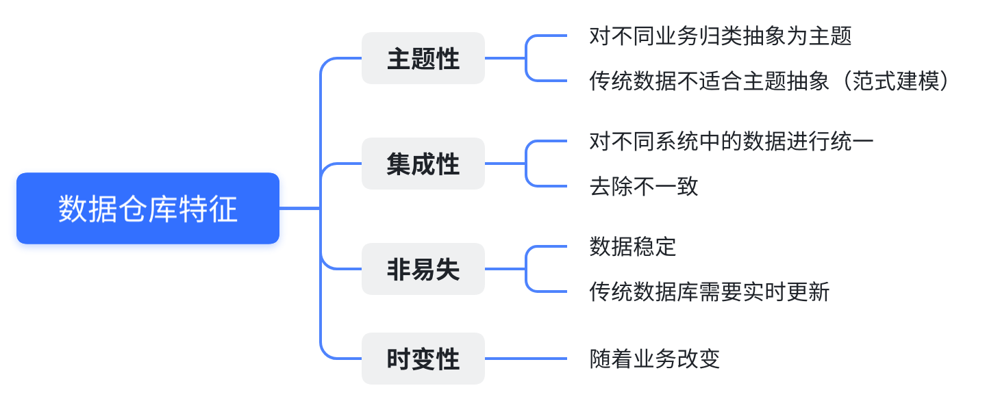

## ch1.5 Hive

### 1.5.1 数据仓库

**1.数据仓库是什么？**
数据仓库是一个**面向主题的**、**集成的**、**非易失的**、**随时间变化的**，用来**支持管理人员决策**的数据集合，数据仓库中包含了粒度化的企业数据。

**2.请概述数据仓库的主要特征？**
数据仓库的主要特征是：**主题性**、**集成性**、**非易失性**、**时变性**。


### 1.5.2 Hive基础概念

**1.Hive是什么?和数据仓库有什么区别?**
Hive是一个开源的数据仓库基础架构，用于在大规模数据集上进行数据存储、管理和分析。它是建立在Hadoop生态系统之上的一种数据仓库解决方案。与传统的数据仓库相比，Hive更适用于处理大数据量的非结构化和半结构化数据，能够在分布式环境中进行高效的数据处理和分析。

**2.Hive产生的背景是什么？**
`Hive`的产生背景主要有两个：

-   **使用成本高**：使用`MapReduce`直接处理数据时，需要掌握`Java`等编程语言，学习成本较高，而且使用`MapReduce`不容易实现复杂查询；
-   **建立分析型数仓的需求**：`Hive`支持类`SQL`的查询以及支持自定义函数，可以作为数据仓库的工具。

**3.Hive和Hadoop生态的关系是什么？**
`HDFS`作为高可靠的底层存储方式，可以存储海量数据。`MapReduce`对这些海量数据进行批处理，实现高性能计算。`Hive`架构位于`MapReduce` 、`HDFS`之上，其自身并不存储和处理数据，而是分别借助于`HDFS`和`MapReduce`实现数据的存储和处理，用`HiveQL`语句编写的处理逻辑，最终都要转换成`MapReduce`任务来运行。`Pig`可以作为`Hive`的替代工具，它是一种数据流语言和运行环境，适用于在`Hadoop`平台上查询半结构化数据集，常用于数据抽取（`ETL`）部分，即将外部数据装载到`Hadoop`集群中，然后转换为用户需要的数据格式。

**4.Hive和传统数据库有什么区别？**
`Hive`在很多方面和传统数据库类似，但是，它的底层依赖的是`HDFS`和`MapReduce`（或`Tez`、`Spark`）。以下将从各个方面，对`Hive`和传统数据库进行对比分析。

| 对比内容 | Hive | 传统数据库 |
| :---: | :---: | :---: |
| 数据存储 | HDFS | 本地文件系统 |
| 索引 | 支持有限索引 | 支持复杂索引 |
| 分区 | 支持 | 支持 |
| 执行引擎 | MapReduce、Tez、Spark | 自身的执行引擎 |
| 执行延迟 | 高 | 低 |
| 扩展性 | 好 | 有限 |
| 数据规模 | 大 | 小 |

**5.Hive和HBase的区别？**
`HBase`是一个面向列式存储、分布式、可伸缩的数据库，它可以提供数据的实时访问功能，而`Hive`只能处理静态数据，主要是`BI`报表数据。就设计初衷而言，在`Hadoop`上设计`Hive`，是为了减少复杂`MapReduce`应用程序的编写工作，在`Hadoop`上设计`HBase`是为了实现对数据的实时访问。所以，`HBase`与`Hive`的功能是互补的，它实现了`Hive`不能提供的功能。

### 1.5.3 Hive核心概念

**1.Hive架构是怎样的？**
`Hive`主要由用户接口模块、驱动模型以及元数据存储模块3个模块组成，其系统架构如下图所示：
]

**2.Hive的存储引擎和计算引擎有哪些？**
Hive存储引擎：`Derby`、`MySQL`。

`Hive`的元数据存储在**关系数据库**中（`Hive`内置的是`Derby`、第三方的是`MySQL`），`HDFS`中存储的是数据。在`Hive`中，所有的元数据默认存储在`Hive`内置的`Derby`数据库中，但由于`Derby`只能有一个实例，也就是说不能有多个命令行客户端同时访问，所以在实际生产环境中，通常使用 `MySQL`代替`Derby`。
Hive计算（Driver）引擎：`MapReduce`、`Tez`或`Spark`等。

驱动模块（Driver）包括编译器、优化器、执行器等，所采用的执行引擎可以是 `MapReduce`、`Tez`或`Spark`等。当采用`MapReduce`作为执行引擎时，驱动模块负责把 `HiveQL`语句转换成一系列`MapReduce`作业，所有命令和查询都会进入驱动模块，通过该模块对输入进行解析编译，对计算过程进行优化，然后按照指定的步骤执行。

**3.Hive有哪些数据类型？**
`Hive`表中的列支持以下基本数据类型：Integers（整型）、Boolean（布尔型）、Floating point numbers（浮点型）、Fixed point numbers（定点数）、String types（字符串）、Date and time types（日期时间类型）、Binary types（二进制类型）

| 大类 | 类型 |
| :--- | :--- |
| Integers（整型） | TINYINT：1字节的有符号整数；<br>SMALLINT：2字节的有符号整数；<br>INT：4字节的有符号整数；<br>BIGINT：8字节的有符号整数 |
| Boolean（布尔型）| BOOLEAN：TRUE/FALSE |
| Floating point numbers（浮点型）| FLOAT：单精度浮点型；<br>DOUBLE：双精度浮点型 |
| Fixed point numbers（定点数）| DECIMAL：用户自定义精度定点数，比如 DECIMAL(7,2) |
| String types（字符串）| STRING：指定字符集的字符序列；<br>VARCHAR：具有最大长度限制的字符序列；<br>CHAR：固定长度的字符序列 |
| Date and time types（日期时间类型） | TIMESTAMP：时间戳；<br>TIMESTAMP WITH LOCAL TIME ZONE：时间戳，纳秒精度；<br>DATE：日期类型 |
| Binary types（二进制类型）| BINARY：字节序列 |

**复杂类型**：STRUCT、MAP、ARRAY

| 类型 | 描述 | 示例 |
| --- | --- | --- |
| STRUCT | 类似于对象，是字段的集合，字段的类型可以不同，可以使用`名称.字段名`方式进行访问 | STRUCT('xiaoming', 12 , '2018-12-12') |
| MAP | 键值对的集合，可以使用`名称[key]`的方式访问对应的值 | map('a', 1, 'b', 2) |
| ARRAY | 数组是一组具有相同类型和名称的变量的集合，可以使用`名称[index]`访问对应的值 | ARRAY('a', 'b', 'c', 'd') |

**4.Hive有哪些数据模型？**
`Hive`的数据都是存储在`HDFS`上的，默认有一个根目录，在`hive-site.xml`中可以进行配置数据的存储路径。`Hive`数据模型的含义是，描述`Hive`组织、管理和操作数据的方式。`Hive`包含如下4种数据模型：库、表、分区、分桶。

**5.请简要介绍Hive的执行流程？**
`Hive`在执行一条`HQL`语句时，会经过以下步骤：

1.  语法解析：`Antlr`定义`SQL`的语法规则，完成`SQL`词法，语法解析，将`SQL`转化为抽象语法树`AST Tree`；
2.  语义解析：遍历`AST Tree`，抽象出查询的基本组成单元`QueryBlock`；
3.  生成逻辑执行计划：遍历`QueryBlock`，翻译为执行操作树`OperatorTree`；
4.  优化逻辑执行计划：逻辑层优化器进行`OperatorTree`变换，合并不必要的`ReduceSinkOperator`，减少`shuffle`数据量；
5.  生成物理执行计划：遍历`OperatorTree`，翻译为`MapReduce`任务；
6.  优化物理执行计划：物理层优化器进行`MapReduce`任务的变换，生成最终的执行计划。

**6.Hive SQL如何优化处理？**
	Hive的优化主要分为：配置优化、SQL语句优化、任务优化等方案。其中在开发过程中主要涉及到的可能是SQL优化这块。

	优化的核心思想是：
	-   减少数据量（例如分区、列剪裁）
	-   避免数据倾斜（例如加参数、Key打散）
	-   避免全表扫描（例如on添加加上分区等）
	-   减少job数（例如相同的on条件的join放在一起作为一个任务）

**7.Hive内部表和外部表的区别?**
	Hive中的表分为内部表和外部表两种类型，两者的区别在于数据的访问和删除：
	

-   内部表的加载数据和创建表的过程是分开的，在加载数据时，实际数据会被移动到数仓目录中，之后对数据的访问是在数仓目录实现。而外部表加载数据和创建表是同一个过程，对数据的访问是读取`HDFS`中的数据；

-   内部表删除时，因为数据移动到了数仓目录中，因此删除表时，表中数据和元数据会被同时删除。外部表因为数据还在`HDFS`中，删除表时并不影响数据。

-   创建表时不做任何指定，默认创建的就是内部表。想要创建外部表，则需要使用`External`进行修饰

**8.为什么内部表的删除，就会将数据全部删除，而外部表只删除表结构?为什么用外部表更好?**
内部表删除时，因为数据移动到了数仓目录中，因此删除表时，表中数据和元数据会被同时删除。外部表因为数据还在`HDFS`中，删除表时并不影响数据。
使用外部表（External Tables）这样可以避免数据的冗余存储，节省存储空间；这样可以避免数据的冗余存储，节省存储空间；通过外部表，Hive可以与其他存储系统进行数据共享和整合；外部表使得数据的迁移和跨平台支持更加灵活和便捷；由于外部表不管理实际数据文件，可以更方便地对数据进行维护和更新。

**9.Hive分区和分桶的区别？**
分区是一个优化的手段，目的是**减少全表扫描**，提高查询效率。在`Hive`中存储的方式就是表的主目录文件夹下的子文件夹，子文件夹的名字表示所定义的分区列名字。
分桶和分区的区别在于：分桶是针对数据文件本身进行拆分，根据表中字段（例如，编号ID）的值，经过`hash`计算规则，将数据文件划分成指定的若干个小文件。分桶后，`HDFS`中的数据文件会变为多个小文件。分桶的优点是**优化join查询**和**方便抽样查询**。

#### 1.5.4 Hive实操
**1.Hive数据倾斜以及解决方案**
Hive数据倾斜是指在数据分布不均匀的情况下，某些任务或操作的执行时间明显高于其他任务或操作。这种不均匀分布可能导致数据处理效率下降，某些节点负载过高，从而影响整体性能。

- 数据预处理：对数据进行拆分、聚合、分区或采样，使数据分布更均匀。
- Hive参数设置：设置`hive.map.aggr`和`hive.groupby.skewindata`等参数，改善Hive数据倾斜。
- HQL语句优化：使用`map join`，采用sum() group by的方式来替换count(distinct)等方式改善数据倾斜的状况。

**2.Hive进行性能优化如果不用参数调优，在map和reduce端应该做什么？**
如果在Hive中没有使用参数进行调优，可以考虑以下在Map和Reduce端进行的操作：
在Map端：

- 数据过滤：尽量在Map端进行数据过滤，减少需要传输到Reduce端的数据量。使用WHERE子句或Map端过滤函数来过滤数据。
- 数据投影：只选择需要的列，避免不必要的数据传输和处理。使用SELECT子句指定需要的列。
- 数据压缩：使用Map输出的压缩功能来减少数据的传输和存储空间。可以使用Hive配置参数设置Map输出的压缩类型。
在Reduce端：
- 数据聚合：尽量在Reduce端进行数据聚合操作，减少数据的传输量。使用GROUP BY子句进行数据分组和聚合。   
- 数据排序：如果需要按特定列对数据进行排序，可以使用ORDER BY子句在Reduce端进行排序操作。这样可以减少数据传输并保持有序性。 
- 数据合并：在Reduce端进行数据合并，减少中间数据的存储和传输。使用聚合函数（如SUM、COUNT等）对数据进行合并操作。
- 数据输出：对于需要输出结果的查询，尽量减少输出的数据量。可以使用LIMIT子句限制输出的行数。

**3.Hive中如何调整Mapper和Reducer的数目？**
在Hive中可以使用以下方式调整Mapper和Reducer的数目：

- 使用`SET`命令设置相关参数：可以使用Hive的`SET`命令来设置与Mapper和Reducer相关的参数。
- 查询中使用`CLUSTER BY`语句：可以使用`CLUSTER BY`语句指定按某个列进行数据分区，这会影响Reducer的数目。Hive会根据`CLUSTER BY`语句中指定的列值进行数据划分，并将相同值的数据发送到同一个Reducer进行处理。

**4.介绍下知道的Hive窗口函数？**

Hive提供了一系列常用的窗口函数，用于在查询中执行各种分析、聚合和排序操作。
- 排名函数：
    -   ROW_NUMBER()
    -   RANK()
    -   DENSE_RANK()
    -   CUME_DIST()
    -   PERCENT_RANK()
- 分析函数：
    -   LAG()
    -   LEAD()
    -   FIRST_VALUE()
    -   LAST_VALUE()
    -   NTH_VALUE()
- 聚合函数：
    -   SUM()
    -   AVG()
    -   MIN()
    -   MAX()
    -   COUNT()
    -   COLLECT_SET()
    -   COLLECT_LIST()
- 窗口函数：  
    -   NTILE()
    -   WIDTH_BUCKET()

**5.请简要介绍Hive Shuffle的具体过程？**

Hive中的Shuffle是在执行Reduce操作前进行的数据重分区和数据传输过程。下面是Hive Shuffle的具体过程：
1.  Map阶段：在Map阶段，输入数据按照指定的分区器进行分区，并生成键值对（Key-Value pairs）。每个Map任务将根据数据的键（Key）将其分发到相应的Reducer任务。
2.  数据排序：在Map阶段结束后，Hive会对每个Map任务输出的键值对进行局部排序。这是为了确保相同键（Key）的数据被连续地发送到同一个Reducer任务，以方便后续的合并操作。
3.  合并和溢写：在Map阶段输出的键值对经过局部排序后，会按照键（Key）进行合并和溢写操作。相同键（Key）的数据会被合并在一起，并写入临时文件中。
4.  分区和数据传输：在Reduce阶段开始之前，Hive根据分区器的设置将临时文件中的数据进行分区，并将每个分区的数据传输到相应的Reducer任务所在的节点上。
5.  Reduce阶段：在Reduce阶段，每个Reducer任务接收到所属分区的数据，对数据进行进一步处理和计算。Reducer任务可以将数据写入HDFS、本地文件系统或其他存储介质。

Hive Shuffle的过程可以分为数据的分区、排序、合并和溢写、分区和数据传输以及Reduce阶段。这个过程确保了相同键的数据被发送到同一个Reducer任务，并提供了数据的局部排序和合并操作，以优化后续的计算和聚合操作。

**6.Hive 支持哪些数据格式？**
hive支持的存储格式包括**TextFile、SequenceFile、RCFile、Avro Files、ORC Files、Parquet**

**7.Hive 在底层是如何存储 NULL 的？**
在Hive中，Null值在底层存储时使用的是"\N"字符串表示，而不是像MySQL中直接使用Null。这是由于Hive的底层存储和查询引擎是基于Hadoop的分布式文件系统，而Hadoop使用文本文件格式存储数据，因此需要使用字符串来表示Null值。

**8.HiveSQL 支持的几种排序各代表什么意思（Sort By/Order By/Cluster By/Distrbute By）？**

1.  Sort By（排序）：通过在查询语句中使用`SORT BY`子句，对结果进行排序。`SORT BY`会对查询结果的所有行进行排序，但不会改变数据的分布。排序是在最后的结果上进行的，并且可以使用多个列进行排序。
2.  Order By（排序）：通过在查询语句中使用`ORDER BY`子句，对结果进行排序。与`SORT BY`不同，`ORDER BY`不仅对最终结果进行排序，还会在数据分发之前进行全局排序。这意味着数据将在排序之后进行分发到不同的Reducer上进行进一步的计算。
3.  Cluster By（聚集排序）：通过在创建表时使用`CLUSTERED BY`子句，指定一个或多个列来对表的数据进行聚集排序。聚集排序会将具有相同键值的行存储在相邻的位置，这样可以提高查询性能，特别是在进行基于聚集键的查询时。
4.  Distribute By（分发）：通过在创建表时使用`DISTRIBUTE BY`子句，指定一个或多个列来控制数据的分发。分发决定了将数据发送到哪个Reducer节点进行处理。`DISTRIBUTE BY`通常与`SORT BY`或`CLUSTERED BY`一起使用，以便在分发数据时根据特定的列进行排序。

需要注意的是，`SORT BY`和`ORDER BY`用于查询语句中对结果进行排序，而`CLUSTER BY`和`DISTRIBUTE BY`用于表的创建过程中控制数据的分布和排序。它们在语义和功能上有一些差异，并且可以根据具体的需求选择合适的排序方式。

**9.Hive 的动态分区是什么？**
Hive中的动态分区是一种在表中动态创建分区的机制。传统上，在Hive中创建分区需要事先定义分区字段和值，并手动将数据加载到相应的分区目录中。而动态分区允许根据数据中的特定列的值自动创建分区，并将数据写入正确的分区目录。

```sql
--- 动态分区样例  date为分区
INSERT INTO TABLE my_table PARTITION(date) SELECT col1, col2, ..., date FROM other_table;
```

**10.HiveSQL 的优化（系统参数调整、SQL 语句优化）？**
HiveSQL的优化可以从系统参数调整和SQL语句优化两个方面展开：

1.  系统参数调整：
    -   资源配置：根据集群规模和工作负载的需求，适当调整Hive的资源配置，包括内存、CPU、并行度等参数，以保证系统能够充分利用资源并提高查询性能。
    -   并行度设置：调整相关参数，如mapreduce.job.reduces、hive.exec.parallel等，控制并行度，使得查询能够充分利用集群资源并加快处理速度。
    -   压缩设置：通过设置相关参数，如hive.exec.compress.output、hive.exec.compress.intermediate等，启用数据压缩，减少IO操作和存储空间，并提高查询性能。
2.  SQL语句优化：
    -   谓词下推：通过使用WHERE子句将过滤操作尽可能地推到数据源进行处理，减少不必要的数据读取和处理操作。
    -   列裁剪：只选择需要的列，避免不必要的数据传输和处理，减少查询开销。
    -   分区裁剪：利用分区信息进行过滤，减少需要处理的数据量，提高查询效率。
    -   常量折叠：对于常量表达式或常量条件，进行折叠计算，减少运行时的计算量。
    -   连接方式选择：根据实际情况选择适当的连接方式，如INNER JOIN、LEFT JOIN、MAP JOIN等，以减少数据移动和计算量。
    -   数据倾斜处理：对于存在数据倾斜的情况，采取相应的优化措施，如使用JOIN优化、分桶表等，减少倾斜对查询性能的影响。

除了上述优化措施，还可以考虑使用Hive提供的性能分析工具，如EXPLAIN语句和Hive性能日志，来分析查询执行计划和性能瓶颈，进一步优化HiveSQL的性能。另外，可以结合使用Hive的索引、统计信息收集、数据压缩等功能，以及使用合适的数据存储格式，进一步提升HiveSQL的性能和效率。