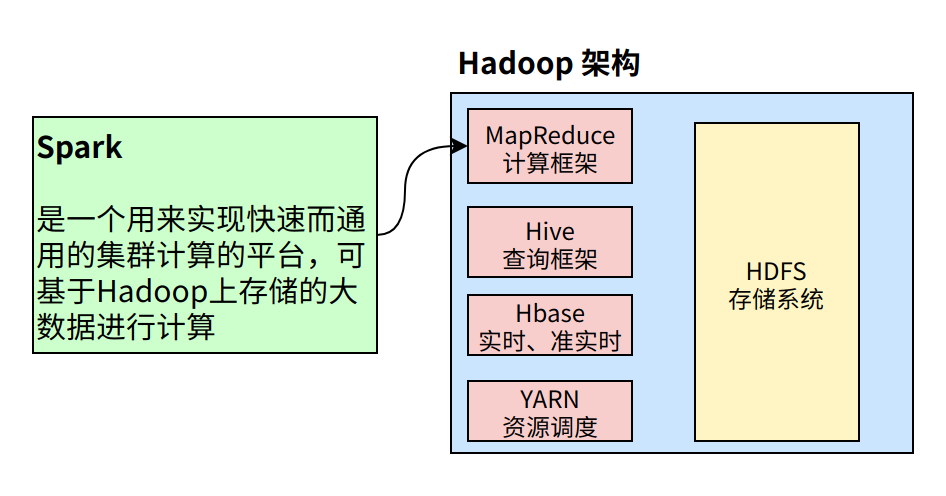
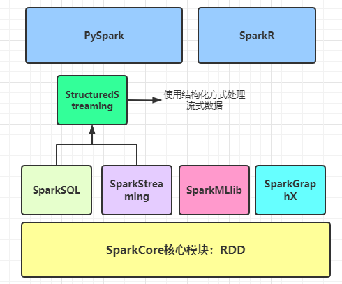
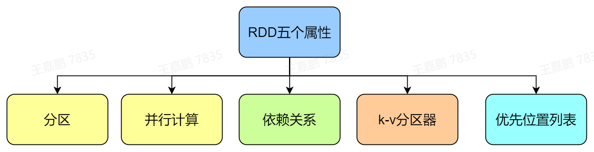
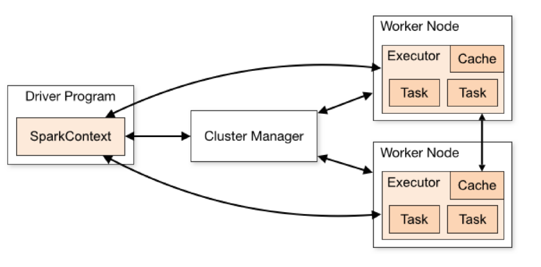
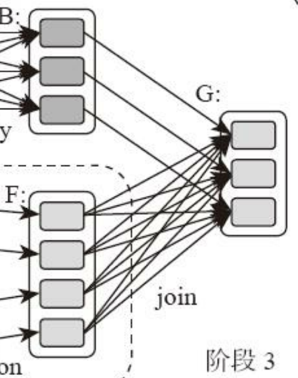

## ch1.6 Spark

### 1.6.1 概述

**1.请简要说明内存和磁盘的异同？**
**内存和磁盘两者都是存储设备**，但内存储存的是我们正在使用的资源，磁盘储存的是我们暂时用不到的资源。可以把磁盘理解为一个仓库，而内存是进出这个仓库的通道。仓库（磁盘）很大，而通道（内存）很小，通道就很容易塞满。

**2.Spark和MapReduce在处理问题的方式上有什么区别？**
MapReduce每一个步骤发生在内存中，但产生的中间值（溢写文件）都会写入在磁盘里，下一步操作时又会将这个中间值`merge`到内存中，如此循环直到最终完成计算。  
而对于Spark，每个步骤也是发生在内存之中，但产生的中间值会直接进入下一个步骤，直到所有的步骤完成之后才会将最终结果保存进磁盘。所以在使用Spark做数据分析时，较少进行很多次相对没有意义的读写，节省大量的时间。

**3.Spark与Hadoop、MapReduce、HDFS的关系？**
Hadoop和Spark两者都是大数据框架，但是各自存在的目的不同。Hadoop实质上是一个**分布式数据基础设施**，它将巨大的数据集分派到一个集群中的多个节点**进行存储**，并具有**计算处理**的功能。Spark则不会进行分布式数据的**存储**，是**计算**分布式数据的工具，可以部分看做是MapReduce的竞品（**准确的说是SparkCore**）。

**4.Spark生态体系是怎样的？**
Spark是一个用来实现快速且通用的集群计算平台，主要表现在以下两个方面：

1.  速度方面：Spark的一个主要特点是能够在内存中进行计算，因此，速度要比MapReduce计算模型更加高效，可以面向海量数据进行分析处理；
2.  通用方面：Spark框架可以针对任何业务类型分析进行处理，比如`SparkCore`离线批处理、`SparkSQL`交互式分析、`SparkStreaming`和`StructuredStreamig`流式处理及机器学习和图计算都可以完成；
以Spark为基础，有支持SQL语句的`SparkSQL`，有支持流计算的`Spark Streaming`，有支持机器学习的`MLlib`，还有支持图计算的`GraphX`。

### 1.6.2 Spark编程模型（RDD）

**1.RDD是什么？**
RDD是Spark的核心概念，是弹性数据集（Resilient Distributed Datasets）的缩写。RDD既是Spark面向开发者的编程模型，又是Spark自身架构的核心元素。
**RDD**是**分布式内存**的一个抽象概念，是只读的记录分区集合，能横跨集群所有节点进行并行计算。Spark建立在抽象的RDD上，可用统一的方式处理不同的大数据应用场景，把所有需要处理的数据转化为RDD，然后对RDD进行一系列的算子运算，通过丰富的API来操作数据，从而得到结果。

**2.RDD有哪些特性？**
RDD共有五大特性：

**一）分区**
  分区的含义是允许Spark将计算**以分区为单位**，分配到多个机器上并行计算。在某些情况下，比如从HDFS读取数据时，Spark会使用位置信息，将计算工作发给靠近数据的机器，减少跨网络传输的数据量。
**二）可并行计算**
  RDD的每一个分区都会被一个计算任务（Task）处理，每个分区有计算函数（具体执行的计算算子），计算函数以分片为基本单位进行并行计算，**RDD的分区数决定着并行计算的数量**。
**三）依赖关系**
  **依赖关系列表**会告诉Spark如何从必要的输入来构建RDD。当遇到错误需要重算时，Spark可以根据这些依赖关系重新执行操作，以此来重建RDD。依赖关系赋予了RDD**的容错机制**。
**四）Key-Value数据的RDD分区器**
  想要理解分区器的概念，我们需要先来比较一下MapReduce的任务机制。MapReduce任务的Map阶段，处理结果会进行分片（也可以叫分区，这个分区不同于上面的分区），分片的数量就是Reduce Task的数量。而**具体分片的策略由分区器Partitioner**决定，Spark目前支持`Hash`分区（默认分区）和`Range`分区，用户也可以自定义分区。  
  总结一下，Partitioner决定了RDD如何分区。通过Partitioner来决定下一步会产生并行的分片数，以及当前并行Shuffle输出的并行数据，使得Spark可以控制数据在不同节点上分区。  
  值得注意的是，其本身**只针对于key-value的形式**（key-value形式的RDD才有Partitioner属性），Partitioner会从0到`numPartitions-1`区间内映射每一个`key`到`partition ID`上。
**五）每个分区都有一个优先位置列表**
  大数据计算的基本思想是："移动计算而非移动数据"。Spark本身在进行任务调度时，需要尽可能的将任务分配到处理数据的数据块所在的具体位置。因此在具体计算前，就需要知道它运算的数据在什么地方。所以，分区位置列表会存储每个Partition的优先位置，如果读取的是HDFS文件，这个列表保存的就是每个分区所在的block块的位置。

**3.RDD有哪些操作函数？**
RDD的操作函数包括两种：转换（transformation）函数和执行（action）函数。一种是转换（transformation）函数，这种函数的返回值还是RDD；另一种是执行（action）函数，这种函数不返回RDD。  
RDD中定义的转换操作函数有：用于计算的`map(func)`函数、用于过滤的`filter(func)`函数、用于合并数据集的`union(otherDataset)`函数、用于根据`key`聚合的`reduceByKey(func, [numPartitions])`函数、用于连接数据集的`join(otherDataset, [numPartitions])`函数、用于分组的`groupByKey([numPartitions])`函数等。
RDD中定义的行动操作函数有：用于获取数据的`collect()`函数、用于统计的`count()`函数、用于获取第一个数的`first()`函数、用于获取前`n`个数的`take(n)`函数、用于归约操作的`reduce(func)`函数等。

**4.RDD的转换操作有几种？**
RDD上的**转换操作分成两种**：

1.  转换操作产生的RDD**不会出现新的分片**，比如`map`、`filter`等操作。一个RDD数据分片，经过`map`或者`filter`转换操作后，其结果还在当前的分片中。就像用`map`函数对每个数据加1，得到的还是这样一组数据，只是值不同。实际上，Spark并不是按照代码写的操作顺序生成RDD，比如`rdd2 = rdd1.map(func)`这样的代码并不会在物理上生成一个新的RDD。**物理上，Spark只有在产生新的RDD分片时候，才会真的生成一个RDD**，Spark的这种特性也被称作**惰性计算**；
2.  转换操作产生的RDD**会产生新的分片**，比如`reduceByKey`，来自不同分片的相同`key` 必须聚合在一起进行操作，这样就会产生新的RDD分片。实际执行过程中，**是否会产生新的RDD分片，并不是根据转换函数名就能判断出来的。**

**5.RDD的弹性表现在哪几点？**
1）自动的进行内存和磁盘的存储切换；
2）基于Lineage的高效容错； 
3）task如果失败会自动进行特定次数的重试； 
4）stage如果失败会自动进行特定次数的重试，而且只会计算失败的分片； 
5）checkpoint和persist，数据计算之后持久化缓存； 
6）数据调度弹性，DAG TASK调度和资源无关； 
7）数据分片的高度弹性。

**6.RDD有哪些缺陷？**
1）不支持细粒度的写和更新操作（如网络爬虫），spark写数据是粗粒度的。所谓粗粒度，就是批量写入数据，为了提高效率。但是读数据是细粒度的也就是说可以一条条的读。
2）不支持增量迭代计算，Flink支持

**7.RDD创建有哪几种方式？**
1）使用程序中的集合创建rdd 
2）使用本地文件系统创建rdd 
3）使用hdfs创建rdd 
4）基于数据库db创建rdd 
5）基于Nosql创建rdd，如hbase 
6）基于s3创建rdd 
7）基于数据流，如socket创建rdd

**8.什么是RDD宽依赖和窄依赖？**
RDD和它依赖的parent RDD(s)的关系有两种不同的类型，即窄依赖（narrow dependency）和宽依赖（wide dependency） 
1）窄依赖指的是每一个parent RDD的Partition最多被子RDD的一个Partition使用 
2）宽依赖指的是多个子RDD的Partition会依赖同一个parent RDD的Partition
也可以说明：Spark把**不需要Shuffle**的依赖，称为**窄依赖**。**需要Shuffle**的依赖，称为**宽依赖**。

**9.RDD的数据结构是怎么样的？**
一个RDD对象，包含如下5个核心属性。  
 1）一个分区列表，每个分区里是RDD的部分数据（或称数据块）。  
 2）一个依赖列表，存储依赖的其他RDD。  
 3）一个名为compute的计算函数，用于计算RDD各分区的值。  
 4）分区器（可选），用于键/值类型的RDD，比如某个RDD是按散列来分区。  
 5）计算各分区时优先的位置列表（可选），比如从HDFS上的文件生成RDD时，RDD分区的位置优先选择数据所在的节点，这样可以避免数据移动带来的开销。

**10.RDD 的血缘机制？**
RDD血缘（RDD Lineage），也可以叫：RDD依赖关系图。当我们计算一个RDD时，会依赖一个或多个父RDD的数据，而这些父RDD又会依赖它自身的父RDD，这样RDD之间的依赖关系就形成了一个有向无环图（也叫DAG图），这些依赖关系被记录在一个图中，这就是RDD的血缘（也叫RDD Lineage）。
RDD的血缘关系具有以下特点：

1.  延迟计算：RDD的转换操作并不立即执行，而是按需计算。当应用程序需要从RDD中获取数据时，Spark会根据RDD的血缘关系自动计算依赖的RDD，并生成执行计划。
2.  容错性：由于RDD记录了从源数据到当前RDD的转换操作，Spark可以根据血缘关系进行数据的重算。当某个RDD数据丢失或发生错误时，Spark可以根据血缘关系重新计算该RDD，保证数据的可靠性和容错性。
3.  优化执行：Spark可以根据RDD的血缘关系进行优化，例如合并多个转换操作、选择合适的执行计划等，以提高执行效率和性能。

通过RDD的血缘关系，Spark可以实现容错性、延迟计算和优化执行等特性，从而有效地处理大规模的数据处理任务。血缘关系的记录和利用也是Spark实现高效计算和数据容错的重要机制之一。

### 1.6.3 Spark核心

**1.Spark和MapReduce的计算中最大区别是什么？**
Spark和MapReduce一样，也遵循着 **移动计算而非移动数据**这一大数据计算基本原则。MapReduce通过固定的`map`与`reduce`分阶段计算，而Spark的计算框架通过`DAG`来实现计算。

**2.Spark作业管理是怎样进行的？**
Spark的RDD有两种函数：转换函数和`action`函数。`action`函数调用之后不再返回RDD。Spark的`DAGScheduler`遇到`Shuffle`时，会生成一个计算阶段，在遇到`action`函数时，会生成一个作业（Job）。RDD里的每个数据分片，Spark都会创建一个计算任务进行处理，所以，一个计算阶段会包含多个计算任务（Task）。  
一个作业至少包含一个计算阶段，每个计算阶段由多个任务组成，这些任务（Task）组成一个任务集合。  
`DAGScheduler`根据代码生成DAG图，Spark的任务调度以任务为单位进行分配，将任务分配到分布式集群的不同机器上进行执行。

**3.请概述Spark 执行过程**
Spark支持多种部署方案（Standalone、Yarn、Mesos等），不同的部署方案核心功能和运行流程基本一样，只是不同组件角色命名不同。
**首先**，Spark在自己的`JVM`进程里启动应用程序，即`Driver`进程。启动后，`Driver`调用`SparkContext`初始化执行配置和输入数据。再由`SparkContext`启动`DAGScheduler`构造执行的DAG图，切分成计算任务这样的最小执行单位。  
**接着**，`Driver`向`Cluster Manager`请求计算资源，用于`DAG`的分布式计算。`ClusterManager`收到请求以后，将`Driver`的主机地址等信息通知给集群的所有计算节点`Worker`。  
**最后**，`Worker`收到信息后，根据`Driver`的主机地址，向`Driver`通信并注册，然后根据自己的空闲资源向`Driver`通报可以领用的任务数。`Driver`根据DAG图向注册的`Worker`分配任务。

**4.请概述Spark应用的计算过程？**
**Spark大数据应用的计算过程**为：Spark会根据程序初始化DAG，由DAG再建立依赖关系，根据依赖关系顺序执行各个计算阶段。
Spark可以根据应用的复杂程度，将过程分割成更多的计算阶段（stage），这些计算阶段组成一个有向无环图（DAG），Spark任务调度器根据**DAG的依赖关系**执行计算阶段（stage）。DAG是有向无环图，即是说**不同阶段的依赖关系是有向**的，计算过程只能沿着依赖关系方向执行，被依赖的阶段执行完成之前，依赖的阶段不能开始执行，同时，这个依赖关系不能是环形依赖，否则就造成死循环。

**5.Spark的`DAG`是如何生成的？**
在Spark中，`DAGScheduler`组件负责应用DAG的生成和管理，`DAGScheduler`会根据程序代码生成DAG，然后将程序分发到分布式计算集群，按计算阶段的先后关系调度执行。

**6.如何进行Spark计算阶段的划分？**
**Spark中计算阶段划分的依据是Shuffle**，而不是操作函数的类型，并不是所有的函数都有`Shuffle`过程。比如Spark计算阶段示例图中，RDD B和RDD F进行join后，得到RDD G。**RDD B不需要Shuffle**，因为RDD B在上一个阶段中，已经进行了数据分区，分区数和分区key不变，就不需要进行`Shuffle`。而RDD F的分区数不同，就需要进行`Shuffle`。Spark把**不需要Shuffle**的依赖，称为**窄依赖**。**需要Shuffle**的依赖，称为**宽依赖**。`Shuffle`是Spark最重要的一个环节，只有通过`Shuffle`，相关数据才能互相计算，从而构建起复杂的应用逻辑。

**7.Shuffle是什么？**
**一个RDD表示一个数据集，一个数据集中的多个数据分片需要进行分区传输，写入到另一个数据集的不同分片中**。MapReduce把这种从数据集跨越，由多个分区传输的过程，叫做**Shuffle**。Spark也需要通过`Shuffle`将数据进行重新组合，把相同`key`的数据放一起。由于会进行新的聚合、关联等操作，所以Spark每次`Shuffle`都会产生新的计算阶段。而每次计算时，需要的数据都是由前面一个或多个计算阶段产生的，所以计算阶段需要依赖关系，必须等待前面的阶段执行完毕后，才能进行`Shuffle`。

**8.Spark和MapReduce一样，都进行了`Shuffle`，为什么Spark会比MapReduce更高效呢？**
可以从**本质和存储方式**两个方面，对Spark和MapReduce进行比较：

-   **从本质上**：Spark可以算是一种MapReduce计算模型的不同实现，Hadoop MapReduce根据`Shuffle`将大数据计算分为Map和Reduce两个阶段。而Spark更流畅，将前一个的Reduce和后一个的Map进行连接，当作一个阶段进行计算，从而形成了一个更高效流畅的计算模型。其本质仍然是Map和Reduce。但是这种多个计算阶段依赖执行的方案可以有效减少对HDFS的访问（落盘），减少作业的调度执行次数，因此执行速度也更快。
-   **从存储方式上**：MapReduce主要使用磁盘存储`Shuffle`过程的数据，而Spark优先使用内存进行数据存储（RDD也优先存于内存）。这也是Spark比Hadoop性能高的另一个原因。

**9.如何进行Spark的优化？**
spark调优比较复杂，但是大体可以分为三个方面来进行 
1）平台层面的调优：防止不必要的jar包分发，提高数据的本地性，选择高效的存储格式如parquet 
2）应用程序层面的调优：过滤操作符的优化降低过多小任务，降低单条记录的资源开销，处理数据倾斜，复用RDD进行缓存，作业并行化执行等等 
3）JVM层面的调优：设置合适的资源量，设置合理的JVM，启用高效的序列化方法如kyro，增大off head内存等等

**10.Spark on Yarn 模式有哪些优点？**
1）与其他计算框架共享集群资源（Spark框架与MapReduce框架同时运行，如果不用Yarn进行资源分配，MapReduce分到的内存资源会很少，效率低下）；资源按需分配，进而提高集群资源利用等。  
2）相较于Spark自带的Standalone模式，Yarn的资源分配更加细致。   
3）Application部署简化，例如Spark，Storm等多种框架的应用由客户端提交后，由Yarn负责资源的管理和调度，利用Container作为资源隔离的单位，以它为单位去使用内存,cpu等。   
4）Yarn通过队列的方式，管理同时运行在Yarn集群中的多个服务，可根据不同类型的应用程序负载情况，调整对应的资源使用量，实现资源弹性管理。  

**11.Spark Cluster 和 Client 模式的区别？**
Spark的Cluster模式和Client模式是两种常见的运行模式，它们在Spark应用程序的部署和执行方式上有一些区别。

1.  Cluster模式（集群模式）：
    -   在Cluster模式下，驱动程序运行在集群中的一个节点上，由集群管理器（如YARN或Mesos）负责启动和管理应用程序。
    -   驱动程序负责整个应用程序的执行控制和监控，而具体的任务执行则由集群中的执行器节点完成。
    -   Cluster模式适用于生产环境，可以充分利用集群资源进行大规模的数据处理任务。
2.  Client模式（客户端模式）：
    -   在Client模式下，驱动程序运行在提交Spark应用程序的客户端机器上。
    -   驱动程序负责整个应用程序的执行控制和监控，同时也参与具体任务的执行。
    -   执行器节点仍然在集群中的工作节点上执行任务，但与驱动程序通过网络通信。
    -   Client模式适用于开发和调试阶段，方便查看应用程序的输出和日志信息。

两者主要区别如下：
-   驱动程序位置：在Cluster模式下，驱动程序运行在集群中的节点上；在Client模式下，驱动程序运行在提交应用程序的客户端机器上。
-   资源占用：在Cluster模式下，驱动程序和执行器分别运行在不同的节点上，充分利用集群资源；在Client模式下，驱动程序也占用部分客户端机器的资源。
-   可视性：在Cluster模式下，集群管理器负责监控和日志管理，可方便地查看集群内部的监控和日志信息；在Client模式下，驱动程序运行在客户端，更容易查看和调试应用程序的输出和日志。

选择Cluster模式还是Client模式取决于具体的应用需求和部署环境。在生产环境中，通常使用Cluster模式来充分利用集群资源进行大规模的数据处理；而在开发和调试阶段，可以使用Client模式方便地查看和调试应用程序的输出和日志信息。

**12.Spark 的 CheckPoint 和容错？**
Spark的Checkpoint是一种机制，用于实现数据的容错和持久化。Checkpoint操作将RDD的数据保存到可靠的存储系统中，以防止数据丢失，并允许在节点故障时重新计算丢失的数据。
Checkpoint 实际上对RDD lineage(RDD依赖关系图谱)的辅助和重新切割修正，当RDD依赖关系过于冗长和复杂时，即依赖关系已达数十代，多个不同的分析任务同时依赖该RDD lineage多个中间RDD时，并且内存难以同时满足缓存多个相关中间RDD时，可以考虑根据多个不同分析任务依赖的中间RDD的不同，使用checkpoint将该RDD lineage 切分成多个子RDD lineage ,这样每一个子 RDD lineage 都会从各自checkpoint 开始算起，从而实现了相互独立，大大减少了由于过于冗长的RDD lineage 造成的高昂容错成本以及内存资源不足问题。
